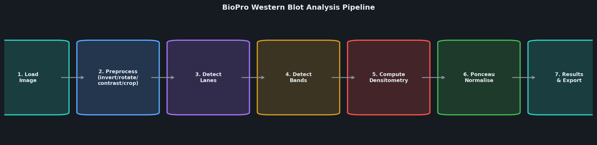
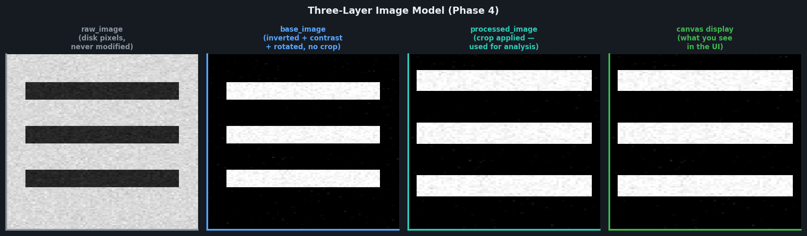
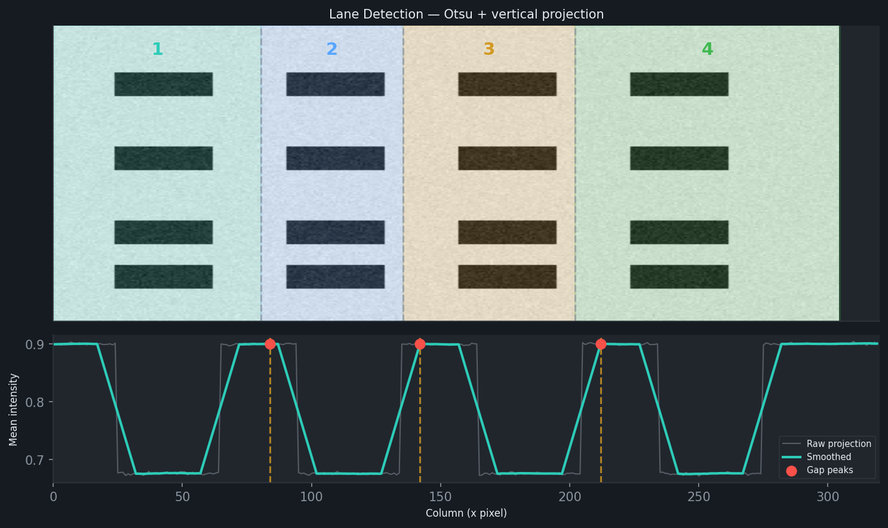
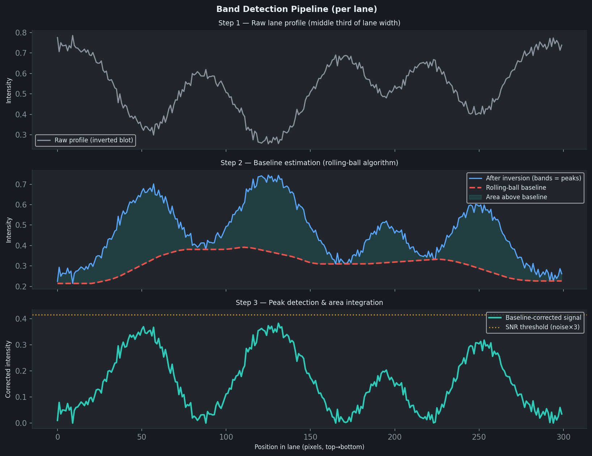
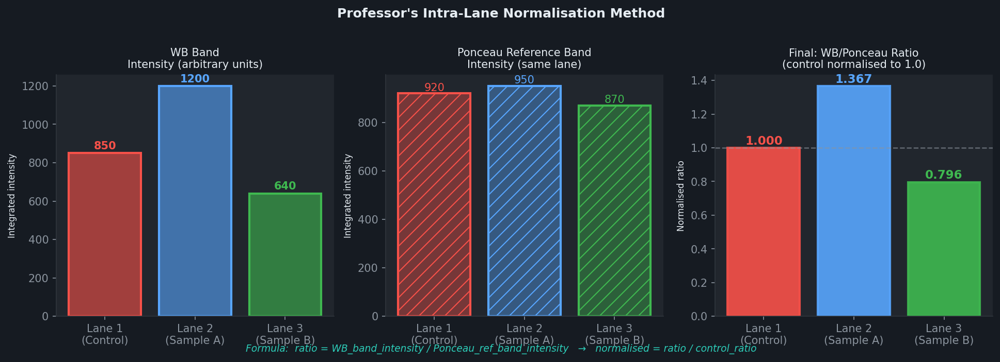
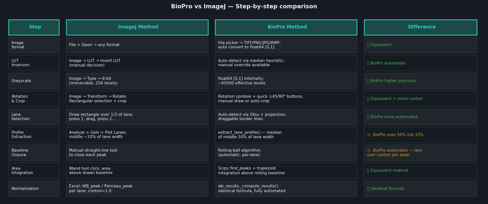
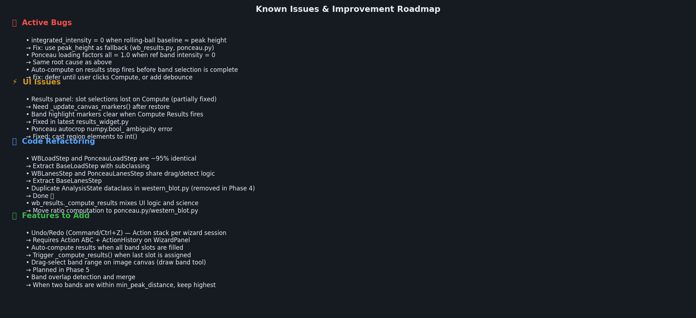

# BioPro — Western Blot Densitometry Pipeline

> An open-source, ImageJ-inspired desktop application for automated western blot quantification.  
> Built with Python · PyQt6 · NumPy · SciPy · scikit-image · Matplotlib

---

## Table of Contents

1. [Overview](#overview)  
2. [The Full Pipeline — Step by Step](#the-full-pipeline)  
3. [Comparison with ImageJ](#comparison-with-imagej)  
4. [Numbers Computed at Each Stage](#numbers-computed-at-each-stage)  
5. [The Ponceau Normalisation Method](#the-ponceau-normalisation-method)  
6. [Image Layer Model](#image-layer-model)  
7. [Known Issues](#known-issues)  
8. [Code Refactoring Opportunities](#code-refactoring-opportunities)  
9. [Roadmap](#roadmap)

---

## Overview

BioPro automates the western blot densitometry workflow that ImageJ requires 20+ manual steps to complete. The entire pipeline runs in a guided 7-step wizard (or 4 extra Ponceau steps when loading correction is enabled).



### Quick start (headless)

```python
from biopro.analysis import WesternBlotAnalyzer

analyzer = WesternBlotAnalyzer()
analyzer.load_image("blot.tif")
analyzer.preprocess(invert_lut="auto")
analyzer.detect_lanes(num_lanes=3)
analyzer.detect_bands()
df = analyzer.compute_densitometry()
print(df[["lane", "position", "raw_intensity", "normalized"]])
```

---

## The Full Pipeline

### Step 1 — Load Image

**File:** `biopro/analysis/image_utils.py` → `load_and_convert()`  
**Class:** `WesternBlotAnalyzer.load_image()`

- Accepts TIFF, PNG, JPG, BMP (any scikit-image-readable format including 16-bit and 32-bit scientific TIFFs)
- Converts to grayscale `float64` in `[0.0, 1.0]` — approximately 65,536 effective intensity levels vs ImageJ's 8-bit (256 levels)
- Stores as `state.raw_image` — **never modified after load** (see Image Layer Model)
- Resets all downstream state

**Output:** `state.raw_image` — shape `(H, W)`, dtype `float64`

---

### Step 2 — Preprocess

**File:** `biopro/analysis/western_blot.py` → `preprocess()`  
**UI:** `wb_load.py`, `ponceau_load.py`

The pipeline applies operations in this exact order, starting fresh from `raw_image` every time any parameter changes:

#### 2a. LUT Inversion

- **Auto-detect:** `auto_detect_inversion()` checks the overall image median. If median > 0.6, the background is light — **no inversion**. If median < 0.4, it compares corner pixels vs centre pixels — if centre is brighter, the image has light bands on dark background → **invert**.
- ImageJ equivalent: *Image → Look Up Tables → Invert LUT* (manual)
- BioPro advantage: fully automatic; manual override available

```python
# Heuristic: dark background, bright centre → invert
if overall_median < 0.4:
    if center_median > corner_median + 0.05:
        invert = True
```

#### 2b. Contrast & Brightness

```
output = clip(α × pixel + β, 0, 1)
```

- Defaults: α = 1.5, β = −0.7 (WB); α = 2.5, β = −0.7 (Ponceau)
- **Auto Contrast** uses 2nd–98th percentile stretching:
  ```
  α = 1 / (P98 − P2)
  β = −P2 / (P98 − P2)
  ```
  This is more robust than min/max stretching when dust specks or dark corners are present.

#### 2c. Rotation

- Applied to `raw_image` (post-inversion/contrast) via `rotate_image()` which calls `skimage.transform.rotate` with bilinear interpolation
- **Auto Rotation** applies current contrast, then detects dominant line angle via Hough transform
- Quick-rotation buttons: −90°, −45°, +45°, +90° for fast coarse adjustment

#### 2d. Crop

**Important:** crop is applied to `base_image` (post-rotation), not `raw_image`. The crop rectangle is always stored in `base_image` coordinates. This means:

- Rotating after cropping keeps the crop valid — the rect is re-applied to the new rotated base image
- Cropping a second time always works correctly — no coordinate drift
- Auto-crop detects the band-containing region via a horizontal projection threshold

**Outputs after preprocess:**
- `state.base_image` — inverted + contrast + rotated, **no crop**
- `state.processed_image` — crop applied to base_image → used by all analysis steps



---

### Step 3 — Detect Lanes

**File:** `biopro/analysis/lane_detection.py` → `detect_lanes_projection()`

BioPro uses an **Otsu threshold + vertical projection block detection** algorithm:

1. Exclude pure-white rotation padding (pixels ≥ 0.99)
2. Compute Otsu threshold on valid pixels × 0.95 to find dark band cores
3. Create binary mask: `band_mask = image < thresh`
4. Sum vertically: `profile[x] = sum(band_mask[:, x])` — each column's "band mass"
5. Smooth with uniform filter (1% of image width)
6. Threshold at 10% of max mass to suppress shadows
7. Extract contiguous blocks (lanes) from thresholded profile
8. Find center of each block
9. Draw boundaries halfway between adjacent centers

**If requested `num_lanes` > detected blocks:** fall back to `create_equal_lanes()` with `margin_fraction=0.0` (edge-to-edge equal spacing)

**Manual adjustment:** In the Lanes step, each internal boundary is rendered as a draggable `LaneBorderItem` (dashed teal vertical line). Dragging updates `analyzer.state.lanes` immediately and re-emits `lanes_detected`. The `_manually_adjusted` flag prevents `on_next` from overwriting manual adjustments with fresh detection.



**Output:** `state.lanes` — list of `LaneROI(index, x_start, x_end, y_start, y_end)`

---

### Step 4 — Detect Bands

**File:** `biopro/analysis/peak_analysis.py` → `analyze_lane()`

For each detected lane, the pipeline runs:

#### 4a. Profile Extraction

```python
extract_lane_profile(image, x_start, x_end, y_start, y_end, statistic="median")
```

Takes the **median** intensity across the middle 50% of the lane width at each row position. The median is more robust than mean for lanes with edge artifacts. This produces a 1-D array of length `(y_end - y_start)`.

> **ImageJ comparison:** ImageJ uses a rectangle covering ~33% of the lane width and computes the mean. BioPro uses 50% and median — slightly more robust but may differ on narrow lanes.

#### 4b. Baseline Estimation

```python
rolling_ball_baseline(profile, radius=50)
```

The rolling-ball algorithm computes a lower envelope of the profile by sliding a ball of given radius under the signal. This models the varying background that real membranes always have.

```
baseline[i] = min over window [i-radius, i+radius] of profile[j]
```
(Implemented via `scipy.ndimage.minimum_filter1d` + `uniform_filter1d` smoothing)

> **ImageJ comparison:** ImageJ requires the user to manually draw a straight line across the base of each peak. BioPro automates this with rolling-ball but loses per-peak user control. This is the primary source of `integrated_intensity = 0` bugs when the baseline sits nearly as high as the peak.

#### 4c. Noise Estimation

```python
noise = median_absolute_deviation(corrected) × 1.4826
```

MAD-based noise estimate — robust to outliers (actual peaks don't inflate the noise estimate). Used to set the SNR threshold.

#### 4d. Peak Detection

```python
find_peaks(corrected, height=max(min_peak_height, noise × min_snr),
           distance=min_peak_distance, prominence=threshold×0.5)
```

A peak must satisfy **all** of:
- Absolute height ≥ `min_peak_height` (default 0.02)
- SNR ≥ `min_snr` (default 3.0): height ≥ noise × 3
- Minimum spacing of `min_peak_distance` pixels (default 10)
- Minimum and maximum width constraints

#### 4e. Band Scoring

Each detected peak gets a "band-likeness" score based on 2D structure — a real band is horizontally coherent across the lane width. Speckles score low and are filtered out.

#### 4f. Area Integration

```python
area = sum(corrected[left_ips : right_ips])
```

Integration bounds come from `find_peaks` width properties (half-maximum crossing points). The area is the sum of baseline-corrected signal within the peak bounds. This is proportional to protein amount.

**Known issue:** When `baseline ≈ profile` (high background, faint band), `corrected = max(profile − baseline, 0) ≈ 0` → `integrated_intensity ≈ 0` even though the peak exists. BioPro falls back to `peak_height` in this case as of the latest fix.

#### 4g. Profile Orientation

`orient_profile_for_bands()` auto-detects whether bands appear as peaks (light bands on dark) or valleys (dark bands on light after inversion). It compares the 95th-percentile positive excursion vs negative dip relative to the baseline, and flips the profile if valleys are more prominent. This can be manually overridden per lane in the Lane Profile dialog.



**Outputs:**
- `state.profiles` — list of oriented 1-D profiles, one per lane
- `state.baselines` — list of baseline arrays
- `state.bands` — list of `DetectedBand` objects with:
  - `lane_index`, `band_index`, `position` (pixel)
  - `peak_height` — height above baseline
  - `integrated_intensity` — area above baseline (the primary quantitative measure)
  - `snr` — signal-to-noise ratio
  - `width` — FWHM in pixels
  - `selected` — whether included in analysis

---

### Step 5 — Ponceau S Band Detection (Optional)

Identical pipeline to Steps 1–4 applied to the Ponceau S stain image of the same membrane. The user selects one reference band per Ponceau lane (by clicking on the canvas in the Ponceau Bands step). These are stored in `ponceau_analyzer.ref_band_indices`.

The Ponceau lanes are mapped to WB lanes via `lane_mapping` (set in the Ponceau Lanes step).

---

### Step 6 — Compute Results (Professor's Method)

**File:** `biopro/ui/wizard/steps/wb_results.py` → `_compute_results()`

This implements the exact intra-lane normalisation described by the professor:

```
ratio[lane] = WB_band_intensity[lane] / Ponceau_ref_band_intensity[lane]
```

Then optionally scale so the control lane = 1.0:

```
normalised_ratio[lane] = ratio[lane] / ratio[control_lane]
```

The WB band is whichever band the user selected in the "Band Comparison" slots on the Results page. If no band is selected for a lane, the highest-intensity detected band is used as a default.

The Ponceau reference band intensity comes from `ponceau_analyzer.get_ponceau_raw_per_wb_lane()` which returns the `integrated_intensity` of the specific Ponceau band the user selected in the Ponceau Bands step.



**Output DataFrame columns:**

| Column | Description |
|---|---|
| `lane` | Zero-indexed lane number |
| `wb_band_position` | Pixel position of the selected WB band |
| `wb_raw` | WB band integrated_intensity (or peak_height fallback) |
| `ponceau_raw` | Ponceau reference band integrated_intensity |
| `ratio` | `wb_raw / ponceau_raw` (or fraction of total if no Ponceau) |
| `normalised_ratio` | ratio scaled to control lane = 1.0 |
| `is_ladder` | Whether this is a ladder lane |

---

## Comparison with ImageJ



### Key differences

**Where BioPro improves on ImageJ:**

1. **Automation** — Lane detection, baseline estimation, and normalisation are all automated. ImageJ requires ~20 manual steps.
2. **Precision** — BioPro works in float64 (~65k levels) vs ImageJ's 8-bit (256 levels).
3. **Repeatability** — Parameters are stored and re-applied, making the analysis reproducible.
4. **Ponceau integration** — The intra-lane WB/Ponceau ratio is computed automatically from the same session.

**Where BioPro differs from ImageJ (may need attention):**

1. **Profile width** — ImageJ uses 33% of lane width; BioPro uses 50%. On wide lanes with uneven loading across the width, this can produce different profiles.
2. **Baseline closure** — ImageJ gives the user full control over where each peak's baseline is drawn (straight line). BioPro's rolling-ball baseline is global per lane, not per peak. For high-background membranes this can cause `integrated_intensity = 0`.
3. **Peak selection** — In ImageJ the user explicitly clicks each peak with the Wand tool. In BioPro, all peaks above the SNR threshold are automatically included. The user can deselect in the Bands step but the default is "include everything detected."

---

## Numbers Computed at Each Stage

```
raw_image         → float64 [0,1] array (H × W)
base_image        → float64 [0,1] after inversion + contrast + rotation
processed_image   → float64 [0,1] after crop (used for all analysis)

per lane:
  profile[]       → float64 [0,1] array length H (median of middle 50% of lane)
  baseline[]      → float64 [0,1] rolling-ball lower envelope of profile
  corrected[]     → max(profile − baseline, 0) — non-negative peaks
  noise           → MAD × 1.4826 (robust σ estimate)
  snr_threshold   → max(0.02, noise × 3.0)

per band:
  position        → int, pixel row of peak maximum
  peak_height     → float, max(corrected) at peak (above baseline)
  integrated_intensity → float, sum(corrected[left:right]) over peak width
  width           → float, FWHM in pixels
  snr             → peak_height / noise

per lane (Ponceau):
  ponceau_raw     → integrated_intensity of user-selected reference band

final output (per lane):
  wb_raw          → selected WB band integrated_intensity
  ponceau_raw     → Ponceau ref band integrated_intensity  
  ratio           → wb_raw / ponceau_raw
  normalised_ratio → ratio / control_lane_ratio
```

---

## The Ponceau Normalisation Method

Western blot intensities are **arbitrary numbers** — they only have meaning relative to each other within the same analysis session. Unequal protein loading between lanes produces false differences in band intensity.

The Ponceau S stain detects total protein. By expressing each WB band relative to the Ponceau signal **in the same lane**, we correct for loading differences.

**Formula (per lane):**
```
ratio = WB_band_integrated_intensity / Ponceau_reference_band_integrated_intensity
normalised = ratio / control_ratio   # so control lane = 1.0
```

**Important:** The Ponceau values are raw integrated intensities (arbitrary units), not loading factors. The division cancels the arbitrary unit scale. The result is a dimensionless ratio expressing how much protein-of-interest is present relative to total protein loaded.

Per the professor's protocol, you should ideally quantify 3 Ponceau bands per lane and average them. BioPro currently supports selecting one reference band per lane. Averaging multiple bands is a planned improvement.

---

## Image Layer Model

BioPro uses a three-layer image architecture to prevent crop coordinate errors:

```
raw_image
    │  inversion + contrast + rotation (from raw every time)
    ▼
base_image                ← crop rectangles are in THESE coordinates
    │  crop applied
    ▼
processed_image           ← what lane/band detection runs on
    │
    ▼
canvas display            ← what you see (= processed_image)
```

In crop mode, the canvas temporarily shows `base_image` so the user draws their crop rectangle in base coordinates. After confirming, `processed_image = base_image[y:y+h, x:x+w]`.

This means:
- Rotating after cropping works correctly (crop rect is re-applied to new base)
- Cropping a second time always works (canvas shows uncropped base, new rect lands in correct space)


---

## Known Issues



### Critical

**`integrated_intensity = 0` for real bands**

Root cause: the rolling-ball baseline radius (default 50px) can sit almost as high as faint band peaks. `corrected = max(profile − baseline, 0) ≈ 0` even though the band has SNR > 10.

Current workaround: `wb_results.py` falls back to `peak_height` when `integrated_intensity < 1e-6`.

Proper fix: reduce baseline radius for faint images, or add a per-band baseline option (ImageJ straight-line method). The baseline radius should be approximately 2× the expected band width.

**Ponceau loading factors all 1.0**

Same root cause — Ponceau reference band `integrated_intensity = 0` → all lanes divide to 1.0.

Fix needed in `ponceau.py:get_ponceau_raw_per_wb_lane()` — add same `peak_height` fallback.

### UI Issues

- Band highlight markers disappear when Compute Results is clicked — fixed in latest `results_widget.py` but requires `_update_canvas_markers()` to be called after `set_results()`
- "Compute Results" should auto-trigger when the last band slot is filled rather than requiring a manual button click

---

## Code Refactoring Opportunities

### 1. Extract `BaseLoadStep`

`WBLoadStep` (`wb_load.py`) and `PonceauLoadStep` (`ponceau_load.py`) share ~95% of their code: file picker, rotation spinbox, quick rotation buttons, contrast/brightness spinboxes, auto-detect buttons, crop preview logic. The only differences are:

- Default contrast values (1.5 vs 2.5)
- Which analyzer they access (`panel.analyzer` vs `panel.ponceau_analyzer`)
- Banner text

**Refactor:** Extract `BaseLoadStep(WizardStep)` with an abstract `_get_analyzer(panel)` method. Reduce ~500 lines to ~250 shared + ~30 per subclass.

### 2. Extract `BaseLanesStep`

`WBLanesStep` and `PonceauLanesStep` share: spinbox, auto-detect checkbox, smoothing spinbox, Detect button, draggable border logic, `_on_lane_count_manually_changed`, `_manually_adjusted` flag, `on_enter`/`on_leave`/`on_next` patterns.

**Refactor:** Extract `BaseLanesStep(WizardStep)` — reduces ~600 combined lines to ~300 shared + ~100 per subclass.

### 3. Move ratio computation to analysis layer

`wb_results._compute_results()` currently mixes UI signal emission with scientific computation. The formula `ratio = wb_raw / ponceau_raw` belongs in `ponceau.py` or `western_blot.py`.

**Refactor:** Add `WesternBlotAnalyzer.compute_intra_lane_ratio(wb_bands, ponceau_raw, control_lane, normalize)` → returns DataFrame. `wb_results` just calls this and emits the result.

### 4. Action/Command pattern for Undo/Redo

Each user action (preprocess change, crop, lane adjust, band add/remove) should be encapsulated as an `Action` object:

```python
class Action(ABC):
    @abstractmethod
    def execute(self, state: AnalysisState) -> None: ...
    @abstractmethod
    def undo(self, state: AnalysisState) -> None: ...

class ActionHistory:
    def __init__(self, max_size=50): ...
    def push(self, action: Action) -> None: ...
    def undo(self) -> None: ...
    def redo(self) -> None: ...
```

`WizardPanel` owns one `ActionHistory` per session, cleared on home navigation. Keyboard shortcuts: Cmd/Ctrl+Z (undo), Cmd/Ctrl+Shift+Z (redo).

### 5. Consolidate state modules

There are two `AnalysisState` definitions — one in `state.py` (canonical) and a now-removed duplicate that was in `western_blot.py`. The `state.py` version is the authoritative one. All imports should come from `biopro.analysis.state`.

---

## Roadmap

| Priority | Item | Files | Notes |
|---|---|---|---|
| P0 | Fix `integrated_intensity=0` properly | `peak_analysis.py` | Reduce default baseline radius; add per-band manual baseline |
| P0 | Fix Ponceau factors = 1.0 | `ponceau.py` | peak_height fallback in `get_ponceau_raw_per_wb_lane` |
| P1 | Auto-compute on last slot fill | `wb_results.py`, `results_widget.py` | Trigger `_compute_results()` when `assign_band_to_active_slot` fills the last None slot |
| P1 | Extract BaseLoadStep | `wb_load.py`, `ponceau_load.py` | ~250 lines saved |
| P1 | Extract BaseLanesStep | `wb_lanes.py`, `ponceau_lanes.py` | ~300 lines saved |
| P2 | Undo/Redo | `wizard/base.py`, new `actions.py` | Action ABC + ActionHistory |
| P2 | Multiple Ponceau bands average | `ponceau.py`, `ponceau_bands.py` | Select 3 bands, average raw intensity |
| P2 | Band overlap detection | `peak_analysis.py` | Merge bands within min_peak_distance |
| P3 | Drag-select band range on canvas | `image_canvas.py` | Dedicated draw-band tool button |
| P3 | Hover sync between canvas and profile dialog | `image_canvas.py`, `lane_profile_dialog.py` | Already partially wired via `profile_hovered` signal |

---

## Architecture Summary

```
biopro/
├── analysis/               ← Headless science layer (no PyQt6 dependency)
│   ├── state.py            ← AnalysisState dataclass (raw/base/processed images)
│   ├── western_blot.py     ← WesternBlotAnalyzer orchestrates all steps
│   ├── ponceau.py          ← PonceauAnalyzer (wraps WesternBlotAnalyzer)
│   ├── lane_detection.py   ← Otsu + projection block detection
│   ├── peak_analysis.py    ← Profile extraction, rolling-ball, find_peaks
│   ├── band_matching.py    ← Cross-lane alignment via cross-correlation
│   └── image_utils.py      ← Load, invert, rotate, contrast, crop utilities
└── ui/                     ← PyQt6 GUI layer
    ├── main_window.py      ← Root window, splitter layout, signal wiring
    ├── image_canvas.py     ← QGraphicsView with lane/band overlays + crop
    ├── results_widget.py   ← Chart + slot-based band comparison + table dialog
    ├── home_screen.py      ← Landing page
    └── wizard/
        ├── base.py         ← WizardStep ABC, WizardPanel, StepIndicator
        ├── setup_screen.py ← Pre-wizard Ponceau toggle
        └── steps/
            ├── wb_load.py          ← Image load + preprocess UI
            ├── wb_lanes.py         ← Lane detection + draggable borders
            ├── wb_bands.py         ← Band detection + manual pick
            ├── wb_results.py       ← Normalisation + compute
            ├── ponceau_load.py     ← Ponceau image load + preprocess
            ├── ponceau_lanes.py    ← Ponceau lane detection
            └── ponceau_bands.py    ← Ponceau band selection + loading factors
```
