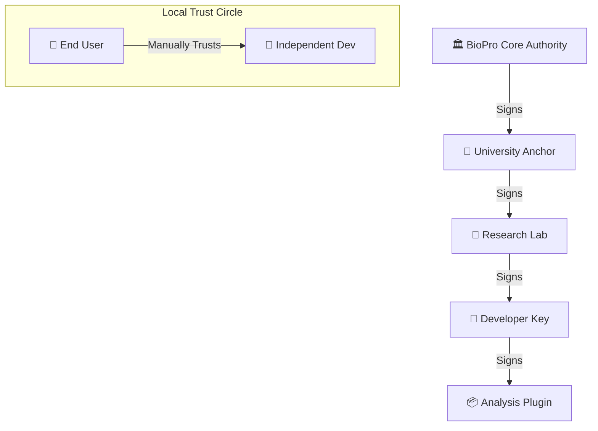

# 🛡️ BioPro Security & Trust Model

BioPro uses a hierarchical **Trust Tree** architecture to ensure that every analysis module you run is authentic, untampered, and verified by a recognized authority.

---

## 🏗️ The Trust Tree Structure

Unlike a simple "binary" lock, BioPro uses a chain of cryptographic proofs. This allows for institutional delegation (e.g., a University trusting a Lab, which in turn trusts a Researcher).

### 1. The Root of Trust
The ultimate anchor is the **BioPro Core Authority**. Its public key is baked into the BioPro application. Every official plugin must eventually trace its heritage back to this root.

### 2. Verified Developers
When a developer is "Verified," it means an Authority (like BioPro or a registered University) has cryptographically signed their public key. This signature is stored in a `delegation.json` file on the developer's machine and bundled into every plugin they sign.

### 3. Organic Trust (Personal Anchors)
BioPro is an open ecosystem. If you want to run code from an independent researcher who isn't signed by a major authority:
*   The app will show a ⚠️ warning.
*   You can choose to **"Trust this Developer"** manually.
*   BioPro saves their ceremony to your local `~/.biopro/trusted_roots/` folder, effectively making them a "Verified Developer" on your machine only.

---

## 🔍 How Verification Works

Whenever you open a plugin, the `TrustManager` performs three strict checks:

1.  **Integrity Check**: It calculates a SHA-256 hash of every file in the plugin directory and compares it to the signed manifest. If even a single line of code is changed, the check fails.
2.  **Signature Check**: It verifies the digital signature of the manifest using the developer's public key.
3.  **Chain Check**: It recursively follows the `trust_chain.json` until it finds an "Anchor" (a key present in your local or hardcoded trusted roots).

---

## 🛠 For Developers: Signing your Work

To become part of the trust tree, you must:
1.  **Initialize**: Generate your keys using `biopro-sign init`.
2.  **Request Delegation**: Send your `public.pub` hex to an authority (like the BioPro team or your PI) to get a `delegation.json`.
3.  **Sign**: Run `biopro-sign sign <folder>` before distribution.

For technical details on the CLI, see the [Developer Handbook](03_Developer_Handbook.md).
