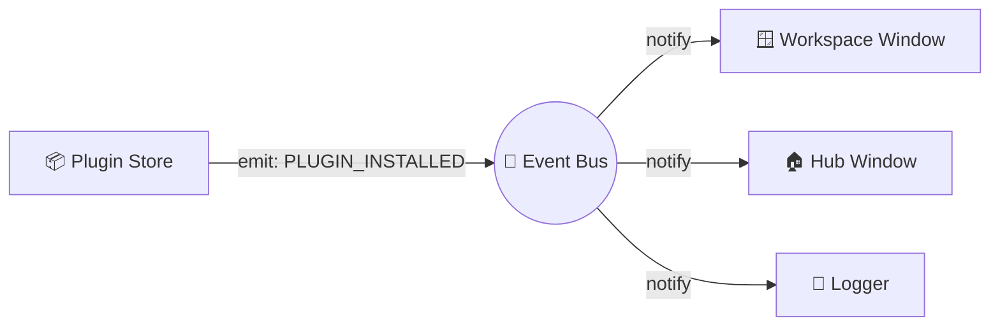

# 🧠 architecture: The Core Nervous System (Event Bus)

BioPro is built on an **Event-Driven Architecture (EDA)**. This means the different parts of the app (like the Plugin Store, the Workspace, and the Core Storage) don't need to know about each other's internals. They just "shout" events, and anyone interested "listens."

---

## 🏗 Why Decoupled?

Imagine if the **Plugin Store** had to manually tell the **Workspace Window** to refresh every time a plugin was installed. If we added a third window (like a Plugin Manager), we'd have to go back and update the Store's code again.

With the **Event Bus**, the Store just says `PLUGIN_INSTALLED`, and any window that exists can choose to react to it.



---

## 🛠 Using the Event Bus (`biopro.core.event_bus`)

The system-wide bus is a singleton instance available as `event_bus`.

### 1. The `BioProEvent` Registry
All events are defined in a central `Enum`. This prevents "Magic String" bugs and allows for autocompletion.

| Event | Triggered When... | Typical Payloads |
| :--- | :--- | :--- |
| `PLUGIN_INSTALLED` | A new module is successfully added to disk. | `plugin_id: str` |
| `PLUGIN_REMOVED` | A module is deleted. | `plugin_id: str` |
| `PROJECT_LOADED` | A `.biopro` file is successfully opened. | `path: str` |
| `THEME_CHANGED` | The global UI theme is swapped. | `theme_name: str` |

### 2. Subscribing to Events
UI components typically subscribe during their `__init__`.

```python
from biopro.core.event_bus import event_bus, BioProEvent

class MyDashboard(QWidget):
    def __init__(self):
        super().__init__()
        # Listen for new installs
        event_bus.subscribe(BioProEvent.PLUGIN_INSTALLED, self._on_plugin_added)

    def _on_plugin_added(self, plugin_id: str):
        print(f"I see you added {plugin_id}! Refreshing my UI...")
        self.refresh()
```

### 3. Emitting Events
Emitting is safe from any thread. BioPro uses PyQt6's signal queuing to ensure callbacks are always executed on the **Main UI Thread**.

```python
def install_plugin(id):
    # (Perform heavy download and move files...)
    # Now notify the world:
    event_bus.emit(BioProEvent.PLUGIN_INSTALLED, id)
```

---

## 🔍 Technical Deep Dive: Thread-Safe Dispatch

The `EventManager` uses a special internal `pyqtSignal`. 

When you call `emit()` from a background worker thread, the signal is **queued** by the Qt Event Loop. It is only dispatched once the Main Thread is free. This prevents "Access Violation" crashes that happen if a background thread tries to update a UI widget directly.

```python
class EventManager(QObject):
    _internal_bus = pyqtSignal(BioProEvent, tuple, dict)
    
    def emit(self, event_type, *args, **kwargs):
        # Queues the work for the UI thread automatically
        self._internal_bus.emit(event_type, args, kwargs)
```

> [!TIP]
> **Memory Safety**: Always `unsubscribe` if your component is destroyed before the app closes to prevent memory leaks!
