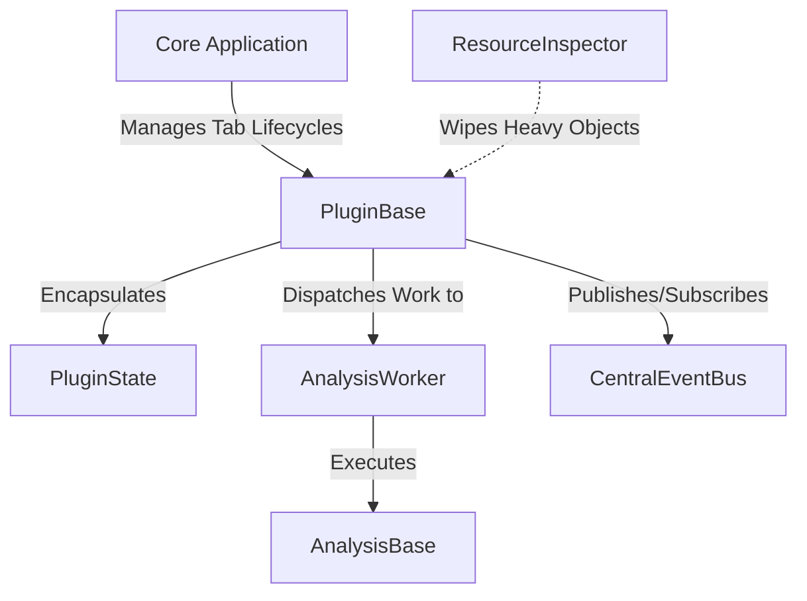
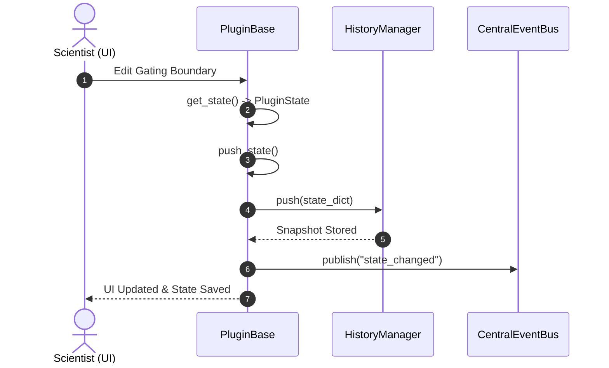
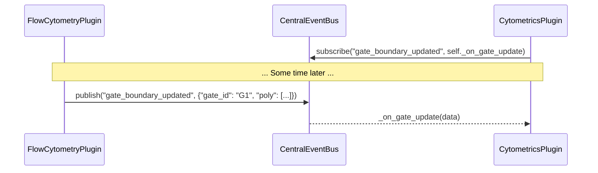

# BioPro SDK Architectural Overview

The **BioPro Software Development Kit (SDK)** is an enterprise-grade development framework designed for computational biologists and software engineers. It provides the standardized infrastructure required to build performant, stable, and theme-compliant analysis plugins for the BioPro platform.

---

## 🏛 Core Philosophy & Architecture

The BioPro SDK is built on three core pillars:
1. **Unidirectional State Flow & Isolation:** Decoupling user interface widgets from underlying mathematical logic via `@dataclass` based states.
2. **Deterministic Memory Sanitization (RAII):** Automatic cleanup of high-memory scientific resources (NumPy arrays, PyTorch tensors) upon tab closure.
3. **Decoupled Inter-Plugin Pub/Sub:** Enabling communication between separate plugins and core services without direct dependencies.



---

## 🔁 State Lifecycle & The Time Machine

BioPro provides a built-in state serialization and history engine. By subclassing `PluginState` and calling `self.push_state()` inside your plugin, the framework automatically manages undo/redo capability.

### State-Saving & History Flow



### Unidirectional Restoration

When a user triggers an **Undo** or **Redo** action, the system reverses the flow:
1. `HistoryManager` pops the previous/next state dictionary.
2. The plugin instantiates a new `PluginState` using `PluginState.from_dict()`.
3. The plugin's abstract `set_state(state)` method is invoked to fully update the user interface.

---

## 📡 The Central Event Bus

To eliminate tight coupling between independent plugins (e.g., sharing gate boundaries between Flow Cytometry and Cytometrics), BioPro utilizes an asynchronous, pub/sub communication bus.



---

## 🧹 Deterministic Resource Cleansing (RAII)

Scientific datasets are often memory-heavy, storing multi-gigabyte multi-dimensional arrays or PyTorch GPU tensors. To prevent memory leaks, `PluginBase` hooks into PyQt's `closeEvent` to perform automated garbage collection via the `ResourceInspector`.

When a tab is closed:
1. The `cleanup()` sequence is initiated.
2. The `ResourceInspector` scans the plugin instance and its state object for heavy fields (e.g., instances of `numpy.ndarray`, `torch.Tensor`, or open `file` handles).
3. The inspector programmatically sets these attributes to `None` and releases file handles/GPU memory, ensuring immediate reclamation by the Python garbage collector.

---

## 🎯 Key SDK Benefits

* **60% Boilerplate Reduction:** Threading, I/O settings, input validations, and history tracking are handled natively by the base classes.
* **Pixel-Perfect Theme Matching:** Automatic reactivity to the global stylesheet and font-scaling systems.
* **Security & Reproducibility:** Cryptographically signed plugins via the `biopro-sign` CLI tool to maintain package integrity.

---

## 🚀 Getting Started in 3 Steps

### 1. Define Your Serializable State
```python
from dataclasses import dataclass
from biopro.sdk.core import PluginState

@dataclass
class MyState(PluginState):
    image_path: str = ""
    threshold: float = 0.5
```

### 2. Implement the Plugin Controller
```python
from biopro.sdk.core import PluginBase
from biopro.sdk.ui import PrimaryButton

class MyPlugin(PluginBase):
    def __init__(self, plugin_id: str, parent=None):
        super().__init__(plugin_id, parent)
        self.state = MyState()

        # Build layout...
        self.btn = PrimaryButton("Run Analysis")
        self.btn.clicked.connect(self.run_process)

    def get_state(self) -> MyState:
        return self.state

    def set_state(self, state: MyState) -> None:
        self.state = state
        # Update your UI widgets here to reflect the state
```

### 3. Register & Deploy
Follow the [Module Author Guide](07_Module_Author_Guide.md) to place your plugin inside the user directory (`~/.biopro/plugins`) and register your manifest file.
