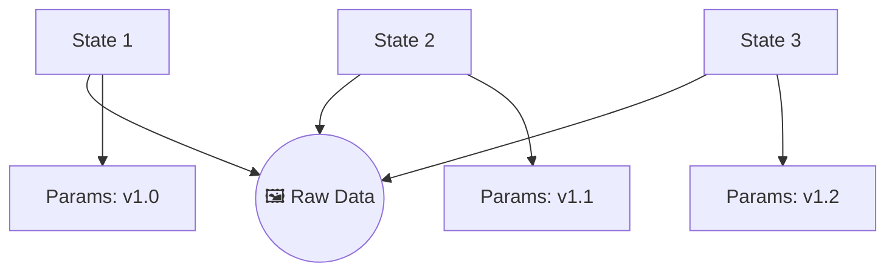

# 🕰 architecture: The Time Machine Engine (History Engine)

BioPro's **HistoryManager** provides a non-destructive workflow for researchers. Every adjustment to a slider or filter is recorded, allowing you to travel back to any previous state without losing your scientific data.

---

## 🏗 Structural Sharing (Memory Optimization)

The primary challenge in image analysis is memory. If you have a 100MB image and perform 50 slider adjustments, a naive undo system would store 50 copies of that image, consuming **5GB of RAM**.

BioPro solves this using **Structural Sharing**:

1.  **Identity Tracking**: When a state (snapshot) is saved, the `HistoryManager` uses the `ResourceInspector` to identify "heavy" objects (like Numpy arrays or Torch tensors).
2.  **Reference Preservation**: Instead of copying the heavy data, the History stack stores a **pointer** to the data already in memory.
3.  **Parameter Copying**: Only the lightweight parameters (strings, thresholds, booleans) are deep-copied.

> **Result**: You can have 1,000 undo steps with zero additional RAM cost for the raw image data.

---

## 🛠 Multi-Module Independence

History is not a single giant timeline. Every analysis module (Western Blot, Flow Cytometry, etc.) has its own independent **Undo/Redo Stack**.

This allows you to:
1.  Adjust your Western Blot results.
2.  Switch to a Flow Cytometry tab and adjust parameters there.
3.  Undo the Western Blot change **without** affecting your Flow Cytometry progress.

The `HistoryManager` acts as a central registry that routes your global "Undo" command (Ctrl+Z) to the **currently active tab**.

---

## 💾 Session Persistence

History is not just for are RAM. When you save your project, BioPro serializes the entire undo/redo chain into `history.json`.

- **Persistence**: You can close the app, come back tomorrow, and still undo that one bad thresholding decision you made today.
- **Portability**: Because the state uses hashes and relative references, the history remains valid even if you move the project folder to a different computer.

---

## 🛠 Internal API Reference (`biopro.core.history_manager`)

### `ModuleHistory(module_id)`
Manages the `undo_stack` and `redo_stack` for a specific module.

- `push(state: dict)`: Captures a new snapshot. Automatically clears the redo stack.
- `undo()`: Pops the current state and returns the previous one.
- `redo()`: Restores a popped state if no new changes were made.

### `HistoryManager`
The global orchestrator.

- `get_module_history(id)`: Returns the stack for a specific module.
- `serialize_all()`: Returns a snapshot of every module's history for project saving.
- `load_all(data)`: Restores every timeline from a file.
