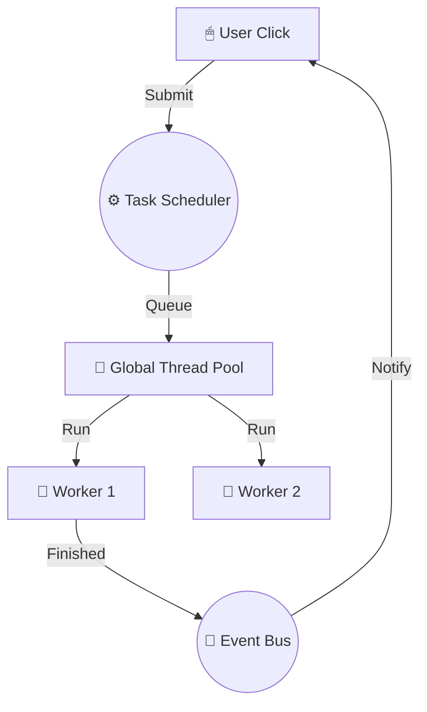

# ⚡️ architecture: High-Performance Scaling & Resource Management

BioPro handles computationally intensive biological analysis by offloading heavy lifting to background threads and strictly managing system resources (RAM/GPU).

---

## 🏗 The Global Task Scheduler

Analysis tasks never run on the **Main UI Thread**. If they did, the application would freeze every time you clicked "Run," preventing you from switching tabs or even moving the window.

### Thread Pooling
BioPro uses a `QThreadPool` to manage worker threads.
- **Resource Control**: By centralizing tasks, BioPro prevents thread exhaustion (where too many plugins spawn too many threads, crashing the OS).
- **Graceful Concurrency**: If you submit 10 analysis tasks but only have 4 CPU cores, the `TaskScheduler` will queue them and run them as threads become available.

---

## 🛠 Analysis Lifecycle

Every background task follows a strict lifecycle managed by the SDK and Core.

1.  **Submission**: You pass an `AnalysisBase` and a `PluginState` to `task_scheduler.submit()`.
2.  **Worker Initialization**: The scheduler wraps your logic in an `AnalysisWorker` (a QObject) and an `AnalysisRunnable`.
3.  **Execution**: The task runs in the background. It can emit `progress(int)` signals without touching the UI.
4.  **Completion**: Upon success, results are merged back into the state, and the UI is notified via the **Nervous System** (Event Bus).

---

## 🧹 Resource Inspection & Memory Safety

Third-party plugins can accidentally "leak" memory if they leave large objects (like 4K images) in variables that aren't cleared. BioPro's **ResourceInspector** acts as a proactive garbage collector.

### Heavy Resource Detection
The `ResourceInspector` scans object trees for "Heavy" items (threshold > 1MB):
- **Numpy Arrays**: Scanned for byte size.
- **Torch Tensors**: GPU tensors are always flagged for immediate release.
- **Matplotlib Figures**: Flagged because they often hold references to GUI backends.
- **File Handles**: Flagged to ensure they are closed.

### Automatic Cleanup
When a plugin tab is closed, BioPro runs a "Cleanse" operation:
1.  All identified heavy objects are nullified.
2.  GPU tensors are moved to CPU and deleted to avoid CUDA out-of-memory errors.
3.  Python's Garbage Collector is given a clear path to reclaim the memory immediately.

---

## 🛠 Internal API Reference (`biopro.core.task_scheduler`)

### `TaskScheduler`
The central registry for all background work.

- `submit(analyzer, state)`: Offloads an analysis to the thread pool.
- `task_finished(task_id, results)`: Global signal emitted when any background task completes.
- `cancel_all()`: Flushes the queue (useful during app shutdown).

### `ResourceInspector`
Utility for deep-inspecting memory usage.

- `get_heavy_resources(obj)`: Returns a list of attribute names and objects that consume significant memory.
- `is_heavy(value)`: Boolean check for specific types (Numpy/Torch/Matplotlib).
