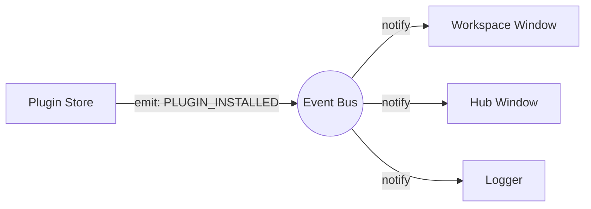

# Core Architecture Overview (Event Bus)

BioPro utilizes an Event-Driven Architecture (EDA) to decouple system components. Modules such as the Plugin Store, Workspace, and Core Storage communicate via a central event bus rather than direct method invocations.

---

## Architectural Rationale

Decoupling components prevents tightly coupled dependencies. For instance, the Plugin Store does not require a direct reference to the Workspace Window to trigger a UI refresh after a plugin installation. Instead, it emits a `PLUGIN_INSTALLED` event, and any interested component can subscribe and react independently.



---

## The Event Bus Implementation (`biopro.core.event_bus`)

The global event bus is instantiated as a singleton `event_bus`.

### 1. The `BioProEvent` Enumeration
Events are strongly typed using a central `Enum` to prevent string-matching errors and enable static analysis.

| Event | Trigger Condition | Expected Payload |
| :--- | :--- | :--- |
| `PLUGIN_INSTALLED` | A plugin package is added and verified. | `plugin_id: str` |
| `PLUGIN_REMOVED` | A plugin package is deleted. | `plugin_id: str` |
| `PROJECT_LOADED` | A `.biopro` project is opened. | `path: str` |
| `THEME_CHANGED` | The global UI theme is updated. | `theme_name: str` |

### 2. Subscribing to Events
UI components typically register their callbacks during initialization.

```python
from biopro.core.event_bus import event_bus, BioProEvent

class MyDashboard(QWidget):
    def __init__(self):
        super().__init__()
        event_bus.subscribe(BioProEvent.PLUGIN_INSTALLED, self._on_plugin_added)

    def _on_plugin_added(self, plugin_id: str):
        self.refresh()
```

### 3. Emitting Events
Event emission is thread-safe. BioPro utilizes PyQt6's signal queuing mechanism to ensure callbacks are executed on the Main UI Thread, preventing cross-thread UI updates.

```python
def install_plugin(id):
    # Perform background tasks...
    event_bus.emit(BioProEvent.PLUGIN_INSTALLED, id)
```

---

## Diagnostic Engine

BioPro includes a `biopro.core.diagnostics` module for error tracking and application state logging.

### 1. In-Memory Event Buffer
The engine maintains a ring buffer of the most recent system events, network requests, and state transitions.

### 2. Global Exception Hook
The core overrides `sys.excepthook`. Upon an unhandled exception:
1. The event buffer is frozen.
2. The stack trace and the buffer contents are serialized into a JSON crash report.
3. The `ERROR_OCCURRED` event is emitted.

### 3. Plugin Logging Integration
Plugins utilizing the standard `biopro.sdk.utils.logging` interface have their logs automatically piped into the diagnostic buffer.

---

## Thread-Safe Dispatch Details

The `EventManager` leverages a specialized internal `pyqtSignal`.
Invoking `emit()` from a background worker thread queues the signal within the Qt Event Loop. It is dispatched sequentially when the Main Thread processes its queue, preventing concurrent access violations on GUI elements.

```python
class EventManager(QObject):
    _internal_bus = pyqtSignal(BioProEvent, tuple, dict)

    def emit(self, event_type, *args, **kwargs):
        self._internal_bus.emit(event_type, args, kwargs)
```
