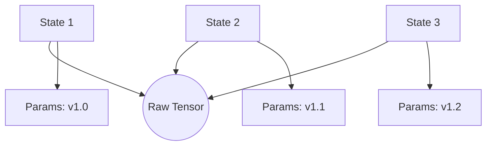

# State and History Management

BioPro's `HistoryManager` tracks state transitions throughout an analysis session. It records adjustments to parameters and filters, enabling non-destructive workflow iteration via undo/redo stacks.

---

## Memory Optimization via Structural Sharing

A primary concern in image analysis is memory overhead. Deep-copying a 100MB image array for every parameter adjustment is unfeasible.

BioPro mitigates this using structural sharing:

1.  **Identity Tracking**: When a state is snapshotted, the `HistoryManager` leverages the `ResourceInspector` to identify high-memory objects (e.g., NumPy arrays, PyTorch tensors).
2.  **Reference Preservation**: Instead of duplicating these high-memory objects, the history stack retains a reference to the existing instance in memory.
3.  **Parameter Copying**: Only lightweight primitive configurations (strings, numerical thresholds, booleans) are deep-copied into the state snapshot.

---

## Module Isolation

The history tracking is partitioned per analysis module. Each module manages its own independent `undo_stack` and `redo_stack`.

This isolation ensures that performing an undo operation in one workspace (e.g., Western Blot) does not revert unrelated changes in another open workspace (e.g., Flow Cytometry).
The global `HistoryManager` routes keyboard events (e.g., Ctrl+Z) to the currently active module's stack.

---

## State Serialization

To support session continuity, state snapshots are serialized to disk (`history.json`) when a project is saved.
This allows the application to recreate the exact undo/redo stack upon subsequent loading, maintaining deterministic reproducibility.

---

## API Reference (`biopro.core.history_manager`)

### `ModuleHistory(module_id)`
Manages the `undo_stack` and `redo_stack` for a localized module context.

- `push(state: dict)`: Pushes a new state snapshot and clears the active redo stack.
- `undo()`: Pops the current state, appends it to the redo stack, and returns the previous state.
- `redo()`: Restores the most recently undone state, provided no divergent pushes have occurred.

### `HistoryManager`
The global orchestrator for all module histories.

- `get_module_history(id)`: Retrieves the history instance for a specified module.
- `serialize_all()`: Returns a serialized representation of all active module histories.
- `load_all(data)`: Deserializes and restores module histories from disk payload.
