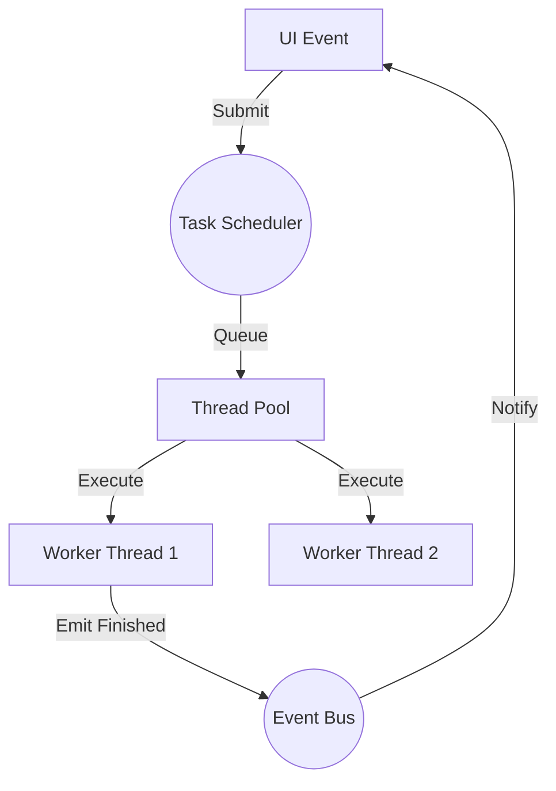

# Performance and Scaling

BioPro handles computationally intensive biological analysis by offloading execution to background threads and actively managing system resources to prevent application unresponsiveness and out-of-memory errors.

---

## Task Scheduler

Long-running analysis routines are prohibited from executing on the Main UI Thread.

### Thread Pooling
BioPro utilizes a `QThreadPool` to govern worker threads.
- **Resource Limits**: The thread pool bounds the maximum number of concurrent threads, preventing thread exhaustion and OS instability when plugins submit excessive tasks.
- **Queueing**: Tasks exceeding the available CPU core count are queued and dispatched sequentially.

---

## Background Analysis Lifecycle

Analysis tasks follow a defined execution lifecycle managed by the `TaskScheduler`.

1.  **Submission**: A plugin submits an `AnalysisBase` instance and a `PluginState` to `task_scheduler.submit()`.
2.  **Encapsulation**: The scheduler wraps the logic within an `AnalysisWorker` (a subclass of `QObject` and `QRunnable`).
3.  **Execution**: The routine executes in a background thread. Thread-safe `progress(int)` signals can be emitted to update UI components.
4.  **Resolution**: Upon completion, results are merged into the application state, and the main thread is notified via the Event Bus.

---

## Resource Inspection and Cleanup

To mitigate memory leaks originating from third-party plugins (e.g., unreleased tensors, persistent matplotlib backends), BioPro incorporates a `ResourceInspector` for proactive garbage collection.

### Resource Identification
The `ResourceInspector` traverses object graphs to identify high-memory references:
- **NumPy Arrays**: Identified and sized.
- **PyTorch Tensors**: GPU-bound tensors are specifically targeted for explicit release.
- **Matplotlib Figures**: Identified to prevent GUI backend reference leaks.
- **Open File Handles**: Identified to prevent file lock accumulation.

### Automatic Cleanup Execution
When a plugin workspace is closed, BioPro triggers a resource cleanse:
1.  Identified high-memory objects are explicitly dereferenced.
2.  GPU-bound tensors are transferred to the CPU and explicitly deleted to prevent CUDA out-of-memory exceptions.
3.  The Python Garbage Collector (`gc.collect()`) is explicitly invoked to reclaim dereferenced memory blocks immediately.

---

## API Reference (`biopro.core.task_scheduler`)

### `TaskScheduler`
The central queue manager for background execution.

- `submit(analyzer, state)`: Queues an analysis task to the thread pool.
- `task_finished(task_id, results)`: Signal emitted upon background task completion.
- `cancel_all()`: Flushes pending tasks from the queue and attempts graceful thread termination.

### `ResourceInspector`
Utility for deep-inspecting memory utilization.

- `get_heavy_resources(obj)`: Returns an inventory of attributes referencing high-memory objects.
- `is_heavy(value)`: Determines if a value matches high-memory object criteria (e.g., NumPy arrays).
