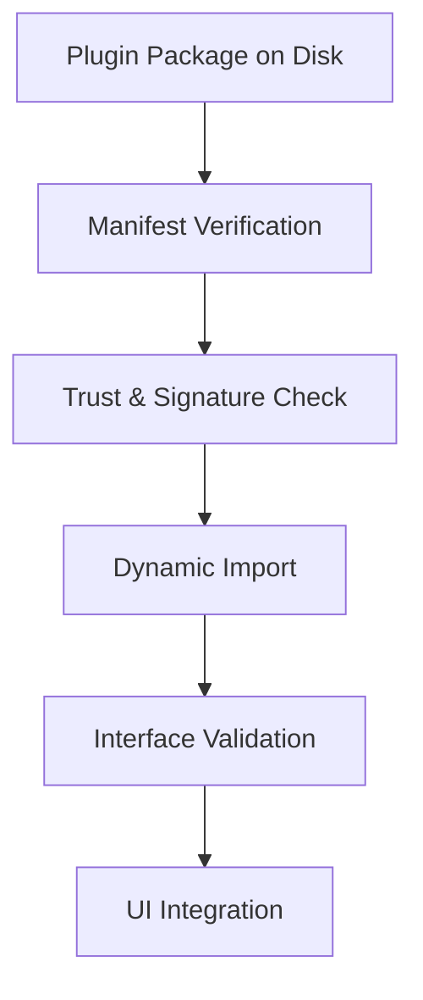

# ModuleManager & Plugin Contract

This page explains how `ModuleManager` discovers, verifies, and loads plugins, and describes the plugin contract that third-party modules must implement to interoperate with BioPro.

## High-level responsibilities

- `ModuleManager`: orchestrates discovery, caching, and lifecycle (load/unload/reload) for plugins.
- `TrustManager`: performs cryptographic verification and supply-chain checks prior to import.
- `PluginBase` (SDK): the runtime contract (state capture, lifecycle hooks, event bus integration) plugins must satisfy.

## Discovery

1. Scan configured plugin directories (bundled and user-space).
2. Parse `manifest.json` (or `pyproject.toml`) to extract `plugin_id`, `entrypoint`, `sdk_version`, and `required_permissions`.
3. Filter out incompatible or malformed manifests.

## Security & Trust

- The `TrustManager` verifies package signatures and checks included hashes against manifests.
- Unverified packages are rejected unless locally trusted via an explicit override.

## Loading lifecycle

1. `ModuleManager.load_module_ui(module_id)` is called from the UI thread.
2. The manager requests `TrustManager.trust_module()`; if verification succeeds, it proceeds.
3. Use `importlib.import_module()` to bring the package into the runtime; heavy CPU work must remain off the UI thread.
4. Validate that the package exposes the expected `get_plugin()` function or `Plugin` subclass and instantiate it.
5. Register the plugin with the `EventBus` and insert its main widget into the `WorkspaceWindow`.

## Plugin contract (recommended public surface)

- `get_plugin() -> PluginBase` — factory function returning an instance implementing the `PluginBase` interface.
- `PluginBase` methods (summary):
  - `get_state() -> dict` — capture serializable plugin state.
  - `set_state(state: dict) -> None` — restore state and update UI.
  - `push_state() -> None` — push current state into HistoryManager.
  - `cleanup() -> None` — release heavy resources and stop background workers.

## Threading considerations

- UI objects must be created on the main thread (Qt requirement). Long-running analysis should be implemented as `AnalysisBase` and executed via `AnalysisWorker` in the global thread pool.
- Event handlers must be thread-safe; prefer posting messages to the EventBus rather than directly mutating shared state.

## Common pitfalls & patterns

- Do not import heavy scientific libraries at module import time; defer within `get_plugin()` to avoid slowing app startup.
- Keep `get_state()` minimal and serializable (JSON-friendly). Use `ResourceInspector` patterns for large binary blobs.
- Always implement `cleanup()` and ensure `ModuleManager` calls it on unload to avoid memory leaks.

## Links

- Source: `biopro/core/module_manager.py` and `biopro/plugins/sdk_utils.py` (see API pages).
