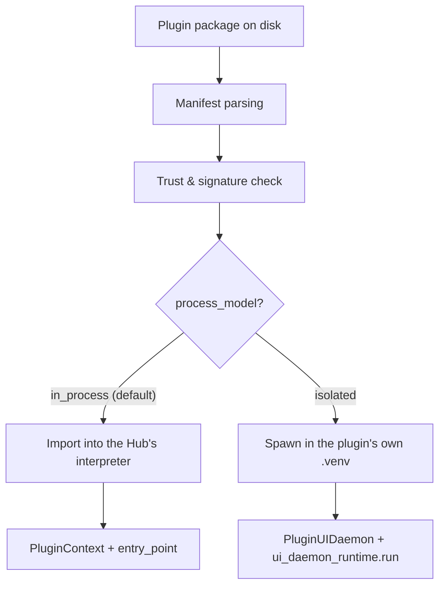

# ModuleManager & Plugin Contract

This page is a short orientation to how `ModuleManager` discovers, verifies,
and loads a plugin. It intentionally stays brief: `docs/internal/25_Core_and_SDK_Boundary.md`
covers the full V1/V2/V3 loading history and the Core/SDK package split in
depth, and `docs/internal/24_Plugin_Communication_Protocol.md` covers the
isolated-process wire protocol — this page previously duplicated (and drifted
from) both, describing a `get_plugin()` factory contract that doesn't exist
in the code. It's gone; below is what's actually there.

## High-level responsibilities

- **`karcytics/core/plugins/discovery.py`** — scans bundled and
  user-installed plugin directories, parses manifests (`pyproject.toml`
  `[tool.karcytics.plugin]`, or a legacy `manifest.json`), and classifies
  each as V1 (dead — see below)/V2 legacy/V3.
- **`TrustManager`** (`karcytics_sdk/host/trust_manager.py`) — verifies
  Ed25519 signatures and per-file SHA-256 hashes against a signed
  `security.json` before anything is imported or spawned. See
  `docs/internal/20_Security_and_Signing.md`.
- **`karcytics/core/module_manager.py`** — orchestrates load/unload,
  dispatches to the in-process or isolated path based on
  `manifest.get("process_model")`.
- **`PluginLoaderFactory`** (`karcytics/core/plugins/loader.py`) — the actual
  import/instantiate logic for in-process plugins (`load_ui`, V2/V3 paths)
  and the zero-arg factory builder for isolated ones (`_load_ui_isolated`).

## Loading lifecycle (in-process, V3 — current)

1. `PluginLoaderFactory.load_ui` sees an `entry_point` in the manifest
   (`"module:function"`, e.g. `"karcytics_plugins.flow_cytometry:initialize"`).
2. The named module is imported directly (via `sys.path`, after
   `PluginEnvironmentInjector.inject_path` puts the plugin's own
   `.venv/site-packages` and `src/` on it).
3. A `PluginContext` is built from a services dict
   (`task_scheduler`, `logger`, `event_bus` — the last one is currently
   always `None`, see doc 25's Migration status) and the parsed manifest.
4. The named function is called as `entry_point(context)` and its return
   value — a `PluginBase` (or `QWidget`) instance — is inserted into the
   Hub's `WorkspaceWindow`.

An isolated plugin (`process_model = "isolated"`) skips all of this —
see doc 24 for that path in full.

## Discovery & security, in one line each

- Malformed or incompatible manifests are filtered out at discovery time,
  not at load time.
- A V1 (`author`-field) manifest is discovered only to explain to the user
  why it's rejected (`OutdatedModuleError`); it never loads.
- An unverified or hash-mismatched package is rejected unless the user
  explicitly grants a local trust override (`TrustManager`'s override flow).

## The real plugin contract

See `docs/internal/16_PluginBase_and_SDK_Contract.md` for `PluginBase`'s
actual shape and a real `entry_point` example — this page only covers how
that contract gets discovered and invoked, not what it looks like.

## Threading considerations

- UI objects are created on the Hub's Qt main thread only — a Qt
  requirement, not a convention. Long-running computation belongs in an
  `AnalysisBase` subclass submitted to the shared `TaskScheduler`
  (`QThreadPool`-backed); see doc 24's "Threading model" for in-process
  plugins.
- Nothing here posts to an `EventBus` on a plugin's behalf — see doc 25's
  Migration status item #2 for the current, real gap there.

## Links

- `docs/internal/25_Core_and_SDK_Boundary.md` — full V1/V2/V3 history, the
  Core/SDK package split, and known migration gaps.
- `docs/internal/24_Plugin_Communication_Protocol.md` — the isolated-process
  wire protocol in full.
- `docs/internal/16_PluginBase_and_SDK_Contract.md` — the actual
  `PluginBase`/`entry_point` shape a plugin author implements.
- `karcytics/core/module_manager.py`, `karcytics/core/plugins/loader.py`,
  `discovery.py` — the real loading orchestration.
