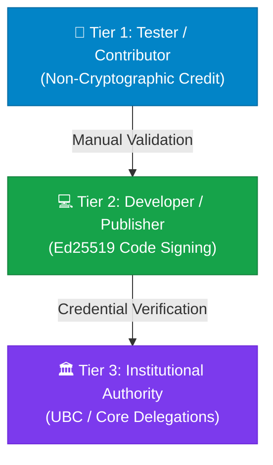

# 🚀 BioPro Collaboration, Onboarding, & Contribution Manual

Welcome to the BioPro contributor network! Whether you are a **QA Tester** validating pipelines, a **Core Developer** publishing computational plugins, or a **Partner University** serving as an institutional authority, this manual guides you through your onboarding process and cryptographic configurations.

---

## 🏛️ The BioPro Security Philosophy
BioPro relies on a **verifiable, decentralized chain of trust**. We guarantee data integrity and run-safety by ensuring that every line of computational code is auditable and cryptographically signed. 

Because different contributors have different levels of access, we separate onboarding into **three progressive tiers**:



---

## 👤 Tier 1: Onboarding a QA Tester (Non-Cryptographic)

**Who this is for**: Testers, QA engineers, scientific writers, and project managers who do not directly author core plugin source code but deserve credit and validation.

### 📝 Step 1: Getting Credited in the Manifest
To credit a tester, the plugin developer simply adds an entry inside the plugin's `manifest.json` under the `authors` array.
*   **Crucial Rule**: Because testers do **not** write code or sign binaries, they do **not** carry the `"sign_code"` permission. This allows BioPro's cryptographic engine to verify the plugin without requiring their signatures.

#### Example `manifest.json` Entry:
```json
{
  "manifest_version": 2,
  "id": "flow_cytometry",
  "version": "1.0.8",
  "authors": [
    {
      "name": "Dr. Kalaimaran Balasothy",
      "role": "Founder & Lead Architect",
      "permissions": ["sign_code"]
    },
    {
      "name": "Jane Doe",
      "role": "Beta Tester",
      "details": "Conducted high-throughput testing with 10k+ cell samples.",
      "permissions": ["run_tests"]
    }
  ]
}
```

### 👁️ How it Renders in the UI:
*   **Details Dialog**: Testers appear beautifully under the **Credits** panel inside the module details window.
*   **Visual Status**: The plugin remains fully **Green (Verified)** because only authors with the `"sign_code"` permission are audited for signatures!

---

## 💻 Tier 2: Onboarding a Developer (Active Code Publisher)

**Who this is for**: Software engineers and bioinformaticians who write python scripts, compile modules, or maintain analytical calculations inside plugins.

As a developer, you must cryptographically sign your plugin code so the host application knows it hasn't been tampered with.

### 🔑 Step 1: Initialize Your Cryptographic Keypair
To start, you need a personal Ed25519 key pair. Run the unified CLI utility:
```bash
biopro-sign init
```
This command generates:
*   `~/.biopro/dev_keys/private.key` (Keep this secret and secure!)
*   `~/.biopro/dev_keys/public.pub` (Your raw 32-byte public key)

### ✉️ Step 2: Register Your Profile on the Registry
To be recognized as a verified publisher in the BioPro Cloud Store:
1. Export your public key block to the console:
   ```bash
   biopro-sign registry
   ```
2. Send this JSON snippet, along with your biography card details and profile picture (avatar) URL, to the BioPro registry administrator:
   ```json
   "your_username": {
     "name": "Your Full Name",
     "role": "Plugin Contributor",
     "bio": "Bioinformatics engineer developing cellular membrane segmenters.",
     "avatar_url": "https://raw.githubusercontent.com/KalaimaranB/BioPro-Distribution/main/avatars/your_username.png",
     "public_key": "your_raw_public_key_hex_goes_here"
   }
   ```
3. Once the registry administrator adds your profile to the centralized `developers.json` and pushes it to GitHub, all client machines will instantly sync your public key!

### ✍️ Step 3: Sign Your Plugin Prior to Release
Before pushing your plugin code to repository channels:
1. Navigate to your plugin folder and run:
   ```bash
   biopro-sign sign .
   ```
2. This parses your plugin structure, validates your `manifest.json`, and writes:
   *   `security.json`: A canonicalized directory of all file hashes.
   *   `signature.bin`: Your Ed25519 signature certifying the security ledger.
   *   `trust_chain.json`: The cryptographic tree showing who signed the developer key.

---

## 🏛️ Tier 3: Onboarding an Institutional Authority (e.g. UBC)

**Who this is for**: University labs, corporate research centers, or centralized pipeline managers who authorize a group of developers.

Institutional authorities are cryptographically linked directly to the BioPro Root CA, allowing them to issue "Delegated Trust Certificates" to their researchers.

### 📜 Step 1: Request Authority Registration
1. Generate an Ed25519 authority key pair.
2. Send your public key hex to the BioPro core administrator.
3. The administrator will append your details to the central `authorities.json` registry file:
   ```json
   {
     "id": "ubc",
     "name": "University of British Columbia",
     "public_key": "ef70051b8c0a876798e98675402599763d15fad9548aad8325f27708cd0b9a68"
   }
   ```
4. The administrator signs the list using the Root Private Key and publishes it to the remote distribution repo.

### 🎓 Step 2: Sign a Developer's Key (Issuing Delegation Certificates)
When a researcher joins your university lab, you sign their developer key using your institutional key. This builds the trust delegation link:
```bash
biopro-sign delegate <path_to_researcher_public.pub> "Researcher Name" --authority <path_to_your_authority_private.pem>
```
*   This outputs `delegation_researcher_name.json`.
*   Give this file to the researcher. They rename it to `delegation.json` and place it in their `~/.biopro/dev_keys/` folder.
*   **The Magic**: The next time they sign a plugin, their co-signed trust chain will automatically resolve:
    `Root CA` ➡️ `University of British Columbia (Authority)` ➡️ `Researcher (Developer)`
    And the plugin card will glow **Green / Verified via UBC** on all machines!

---

## 🚨 Troubleshooting Common Security Alerts

*   **Yellow Warning: Unverified Self-Signed Identity**
    *   *Cause*: The plugin has a valid developer signature, but the developer's public key has not been added to `developers.json` in the central cloud repository, or the client hasn't synced with the network.
    *   *Fix*: Contact the administrator to submit your profile + public key, or manually approve the developer as a local override.
*   **Red Alert: Security Critical**
    *   *Cause*: A file hash inside the plugin does not match the signed hash inside `security.json` (meaning code was tampered with or modified after signing).
    *   *Fix*: The developer must run `biopro-sign sign .` again to re-sign the updated plugin directory.
