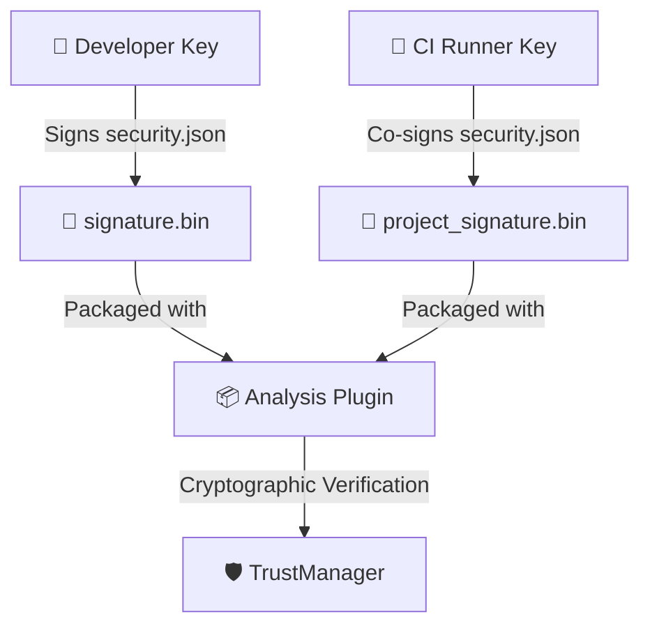

# 🛡️ BioPro Developer Security & Code-Signing Guide

This comprehensive guide provides developers with the knowledge and tools to cryptographically sign plugins, configure detailed author Role-Based Access Control (RBAC), and integrate secure automated code-signing pipelines within local Git workflows and GitHub Actions release pipelines.

---

## 🏗️ Architectural Overview

BioPro enforces a **double-signing asymmetric defense-in-depth model**. A distributed plugin must satisfy both trust parameters before it is authorized to run inside the host:
1. **Developer Signature (`signature.bin`)**: The leaf signature generated by the local developer's private Ed25519 key over the canonical bytes of `security.json`.
2. **Project CI Co-Signature (`project_signature.bin`)**: The secondary signature generated by the organization's automated CI runner private key, validating that the plugin went through official testing pipelines without tampered additions.



---

## 🔑 1. Ed25519 Developer Key Generation

To sign a plugin, you must possess an Ed25519 keypair. BioPro provides a native CLI tool to initialize your cryptographic identity.

### Option A: Using the `biopro-sign` CLI (Recommended)
From your terminal, execute:
```bash
biopro-sign init
```
This command generates:
* `~/.biopro/dev_keys/private.key`: Your private key (keep this strictly confidential!).
* `~/.biopro/dev_keys/public.pub`: Your public key (distributable).

### Option B: Generating Keys via Python Script
If you are scripting key creation programmatically, use the following snippet:
```python
from cryptography.hazmat.primitives.asymmetric import ed25519
from cryptography.hazmat.primitives import serialization

# Generate key pair
private_key = ed25519.Ed25519PrivateKey.generate()
public_key = private_key.public_key()

# Serialize private key to PEM format
private_pem = private_key.private_bytes(
    encoding=serialization.Encoding.PEM,
    format=serialization.PrivateFormat.PKCS8,
    encryption_algorithm=serialization.NoEncryption()
)

# Serialize public key to Hex
public_bytes = public_key.public_bytes(
    encoding=serialization.Encoding.Raw,
    format=serialization.PublicFormat.Raw
)
public_hex = public_bytes.hex()

print(f"Developer Public Key Hex: {public_hex}")
```

---

## 📝 2. Configuring Detailed Author Profiles & RBAC

The V2 manifest structure decouples metadata from cryptography. Your `manifest.json` file must contain an `authors` array declaring the roles, details, and code-signing permissions of each team member.

### Strict RBAC Validation Rules:
* Every author carrying the `"sign_code"` permission **MUST** sign the plugin's `security.json` ledger. If their signature is missing or untrusted, verification fails.
* Authors carrying other roles (e.g. `"Tester"`, `"Technical Writer"`) without `"sign_code"` are not required to provide signatures, supporting smooth collaborative workflows.

### Sample V2 Split-Manifest (`manifest.json`):
```json
{
  "manifest_version": 2,
  "id": "cell_segmenter",
  "version": "1.2.0",
  "description": "Premium 3D cellular membrane boundary detection pipeline.",
  "dependencies": ["numpy", "scipy"],
  "authors": [
    {
      "name": "Dr. Alice Vance",
      "role": "Lead Scientist",
      "details": "Core algorithm designer, specialized in fluorescent image sorting.",
      "permissions": ["sign_code"]
    },
    {
      "name": "Bob Miller",
      "role": "QA Engineer",
      "details": "Performs integration testing and regression parity scans.",
      "permissions": ["run_tests", "write_docs"]
    }
  ]
}
```

---

## 🛠️ 3. Integrating git Pre-Commit Hooks

To ensure developers never accidentally commit unsigned or modified code, you can configure an automated git pre-commit hook that re-signs staged edits automatically.

### Step 1: Create a pre-commit script
Create or append to `.git/hooks/pre-commit` in your repository:

```bash
#!/bin/bash
# Pre-commit Hook to ensure signed plugin integrity

echo "🛡️ BioPro Pre-Commit Guard: Scanning staged plugin folders..."

# Find all plugin folders with modified python files
MODIFIED_PLUGINS=$(git diff --cached --name-only | grep -E '^plugins/[^/]+/' | cut -d'/' -f1,2 | uniq)

if [ -z "$MODIFIED_PLUGINS" ]; then
    echo "No modifications detected in plugins/. Proceeding with commit."
    exit 0
fi

for PLUGIN in $MODIFIED_PLUGINS; do
    echo "Re-signing modified plugin: $PLUGIN"
    # Execute developer sign CLI
    biopro-sign sign "$PLUGIN"
    
    # Restage updated security ledger files
    git add "$PLUGIN/security.json" "$PLUGIN/signature.bin"
done

echo "✅ Pre-Commit re-signing complete."
exit 0
```

### Step 2: Make the hook executable
```bash
chmod +x .git/hooks/pre-commit
```

---

## 🤖 4. GitHub Actions CI/CD Double-Signing Pipeline

Double-signing prevents single-developer compromise. The developer signs the plugin locally, and when pushing a release, the GitHub Actions runner applies the second cryptographic approval (`project_signature.bin`) using a highly protected repository CI secret.

### Step 1: Add your Project Private Key to GitHub Secrets
1. Generate a dedicated Project Ed25519 private key.
2. In your GitHub Repository, navigate to **Settings -> Secrets and variables -> Actions**.
3. Create a new Repository Secret named `BIOPRO_PROJECT_PRIVATE_KEY` and paste the PEM contents.

### Step 2: Configure the Release Workflow
Add the following workflow configuration in `.github/workflows/release_signing.yml`:

```yaml
name: BioPro CI Release Double-Signing

on:
  push:
    tags:
      - 'v*'

jobs:
  build-and-sign:
    runs-on: ubuntu-latest
    
    steps:
      - name: Checkout Code
        uses: actions/checkout@v4
        with:
          fetch-depth: 0

      - name: Set up Python
        uses: actions/setup-python@v5
        with:
          python-version: '3.11'

      - name: Install dependencies
        run: |
          python -m pip install --upgrade pip
          pip install biopro

      - name: Execute Project Double-Signing Gate
        env:
          BIOPRO_PROJECT_PRIVATE_KEY: ${{ secrets.BIOPRO_PROJECT_PRIVATE_KEY }}
        run: |
          echo "🔐 Starting Project Runner double-signature process..."
          # Loop through and sign every plugin inside the release bundle
          for dir in plugins/*/; do
            if [ -d "$dir" ]; then
              echo "Applying CI co-signature to $dir..."
              biopro-sign project-sign "$dir"
            fi
          done

      - name: Verify Signed Outputs
        run: |
          for dir in plugins/*/; do
            if [ -d "$dir" ]; then
              echo "Verifying split-manifest integrity for $dir"
              ls -l "$dir/security.json"
              ls -l "$dir/signature.bin"
              ls -l "$dir/project_signature.bin"
            fi
          done

      - name: Create Release
        uses: softprops/action-gh-release@v1
        with:
          files: plugins/**
        env:
          GITHUB_TOKEN: ${{ secrets.GITHUB_TOKEN }}
