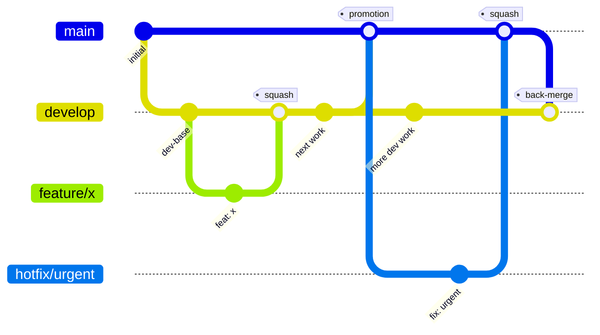
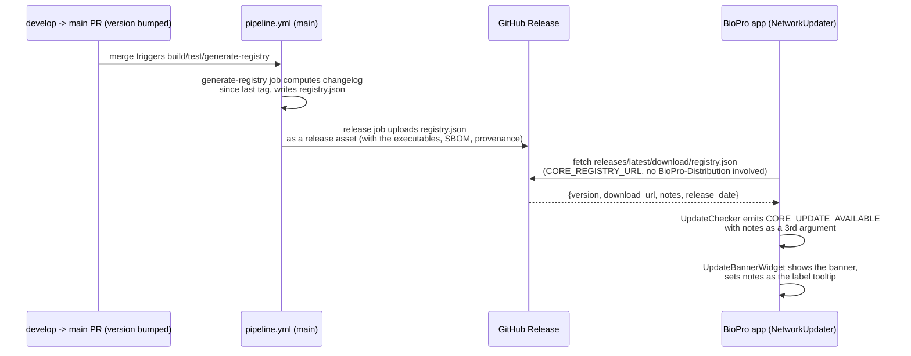

# Git Branching Engine

This document explains the *system*, not the commands — what each branch is for, how CI cost maps to each one, how the enforcement gate actually blocks a bad merge, and how a release flows through to the in-app update banner. For day-to-day commands (how to open a PR, commit format, hotfix steps), see [CONTRIBUTING.md](https://github.com/KalaimaranB/BioPro/blob/main/CONTRIBUTING.md).

## The branches

| Branch | Role | Protection | Lifetime |
| --- | --- | --- | --- |
| `main` | Production. What a released build was compiled from. | Protected, `enforce_admins: true`, requires `audit-and-lint` + `test` + `enforce-workflow` | Permanent |
| `develop` | Staging/integration. Where feature work lands and accumulates before a release. | Protected, `enforce_admins: true`, requires `audit-and-lint` + `enforce-workflow` | Permanent |
| `feature/*`, `fix/*`, `chore/*`, `docs/*` | A single unit of work, always into `develop` | None (auto-deleted on merge) | Days |
| `hotfix/*` | An urgent fix that can't wait for the next `develop → main` promotion | None (auto-deleted on merge) | Hours |

## Core Merge Strategies

To keep this engine running flawlessly, there is a strict dichotomy in how branches are merged:

1. **Incoming Work = Squash Merge**
   Whenever human work (`feature/*`, `fix/*`, `chore/*`, `docs/*` into `develop`, or `hotfix/*` into `main`) is merged, you must use **Squash and Merge**. This collapses all messy work-in-progress commits into a single, clean release note dot on the target branch.
2. **Environment Syncs = Standard Merge**
   Whenever environments are synchronized (`develop` promoting to `main`, or the automated `main` back-merge to `develop`), it must use a **Standard Merge Commit**. This preserves the topological graph history and proves to Git that both branches share identical DNA, preventing massive text conflicts in the future.

Everything short-lived (`feature/*`, `fix/*`, `chore/*`, `docs/*`, `hotfix/*`) points at `develop` or `main` and disappears on merge. Only `main` and `develop` are permanent — that's deliberate: a permanent branch is something you have to protect, gate, and reason about forever, so the count is kept to exactly the two that need it.

## Why CI cost differs by branch

`pipeline.yml` triggers on both `main` and `develop`, but the expensive jobs are gated by which one is the *target*:

- **Every PR into `develop`** (including `docs/*` — it follows the same path as `feature/*`/`fix/*`/`chore/*`, no shortcuts): `audit-and-lint` (ruff, mypy, pip-audit, one ubuntu pytest run) + `enforce-workflow` + `docs-lint` (markdown/mermaid validation, runs on both branches regardless of content). This is the cheap, fast-fail tier — cheap enough to run on every small feature merge without worrying about cloud spend.
- **Only the `develop → main` promotion PR** (or a direct push to `main`, or manual dispatch): additionally runs the `test` job's full macOS + Windows matrix, and — if `pyproject.toml`'s version was bumped **and hasn't already shipped** (see Versioning below) — `build` (PyInstaller compilation on both platforms), `generate-registry`, SLSA provenance, and the GitHub Release itself.

The tradeoff being made: cross-platform coverage and packaging are expensive (multiple paid runner-minutes per run) and only actually matter right before something ships. Day-to-day feature work doesn't need macOS/Windows executables built on every commit — it needs fast feedback. Concentrating the expensive tier at the promotion point means you pay for full coverage exactly once per release, not once per feature branch.

## How `enforce-workflow` is a hard gate, not a suggestion

`enforce-workflow` is a required status check on both `develop` and `main` branch protection, with `enforce_admins: true`. Concretely, on every `pull_request` event it:

1. Regex-checks the PR title against Conventional Commits (`feat:`, `fix:`, `chore:`, `docs:`, `refactor:`, `test:`, `ci:`, optional `(scope)` and `!`).
2. Checks `github.base_ref`/`github.head_ref`: a PR targeting `main` must come from `develop` or `hotfix/*`; a PR targeting `develop` must come from `feature/*`, `fix/*`, `chore/*`, `docs/*`, `hotfix/*`, or `ci/*`.

If either check fails, the job exits non-zero and the check goes red. Because it's a *required* check on a *protected* branch with admin enforcement on, GitHub's merge button is disabled for that PR — there is no environment where a `feature/x → main` PR or a non-conventional title can be merged through the UI or API, including by the repo owner. This is what makes the branch model real instead of a convention that erodes the moment things get busy.

## How a release reaches the update banner

This is the self-published registry flow, replacing the old path where the app depended on `BioPro-Distribution` for its own version:

`registry.json`'s `notes` field is built from `git log <last-tag>..HEAD --no-merges`, one bullet per commit subject — which is why PR titles following Conventional Commits matter beyond just passing `enforce-workflow`: they're literally what shows up as the "what changed" text in the app.

Plugin version lookups are unchanged and still go through `BioPro-Distribution/registry.json` — this self-published path is core-app-only, by design, since plugins are a separate versioning surface with their own release cadence.

## Versioning quick reference

`check-version` decides whether to build by checking whether a GitHub Release for `v<pyproject-version>` already exists (`gh release view`) — not by diffing commits. That means a promotion that fails partway through can simply be retried at the same version; it only becomes "already shipped" once a release actually publishes. See [CONTRIBUTING.md § 4. Versioning & Release Mechanics](https://github.com/KalaimaranB/BioPro/blob/main/CONTRIBUTING.md#4-versioning--release-mechanics) for the full explanation, including why an already-shipped tag should never be reused.
