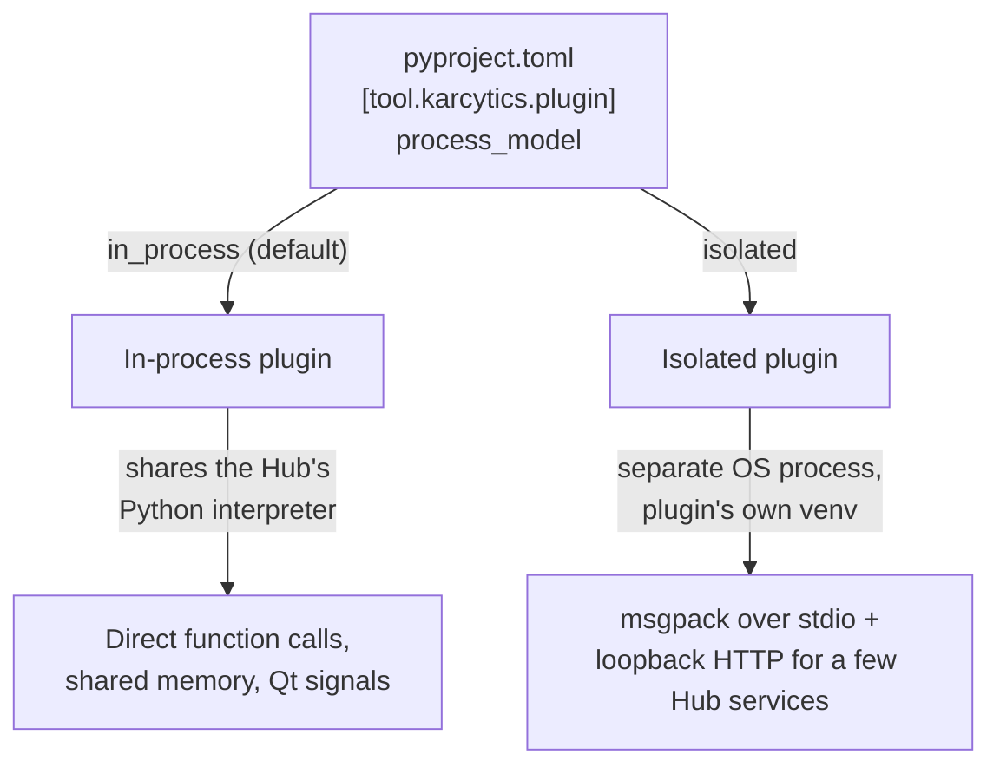
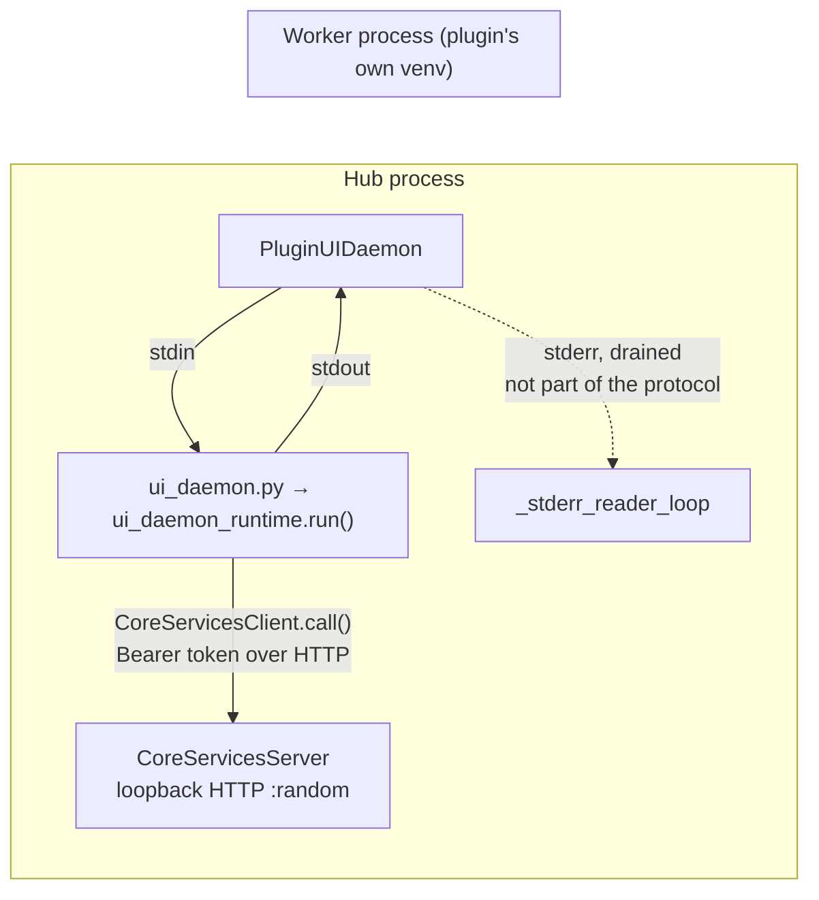
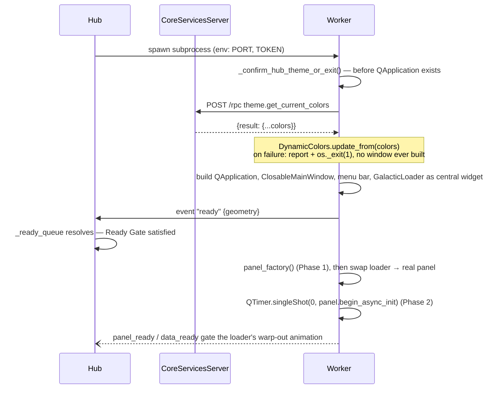
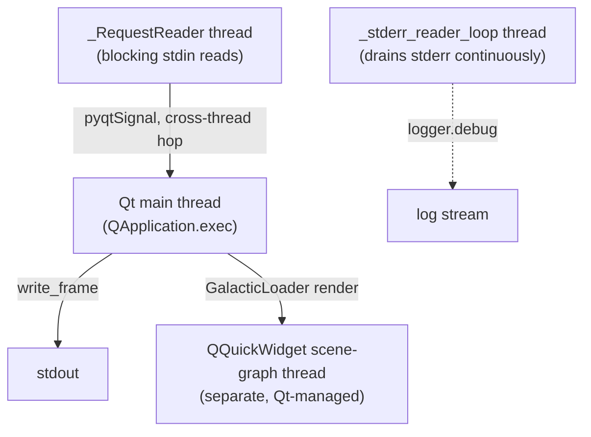

# Plugin Communication Protocol

This document describes, precisely, how the Karcytics Hub talks to a plugin —
both plugins that share the Hub's own process and plugins that run in a
process of their own. It covers the wire format, the threading model on
both sides, what actually crosses the process boundary, and the failure
modes that have bitten this protocol in practice.

Two execution models coexist today, chosen per-plugin:



`process_model` lives in the plugin's `pyproject.toml` under
`[tool.karcytics.plugin]`, is flattened into the manifest dict by
`karcytics_sdk/plugin/manifest_parser.py`, and typed as
`PluginManifest.process_model: str = "in_process"`
(`karcytics_sdk/plugin/manifest.py:9,20`, `VALID_PROCESS_MODELS = ("in_process", "isolated")`).
Every dispatch point in the Hub checks the same condition —
`manifest.get("process_model") == "isolated"` — in
`karcytics/core/plugins/loader.py:59`,
`karcytics/core/module_manager.py:196,222,253`, and
`karcytics/ui/windows/workspace/plugin_loader.py:90`. Anything else (an
explicit `"in_process"`, or the key simply absent) takes the in-process path.
As of this writing, isolation is opt-in and only the Flow Cytometry plugin
uses it.

---

## Part 1 — In-process plugins

### How the plugin's code enters the Hub's interpreter

Two loading paths exist, both inside `PluginLoaderFactory.load_ui`
(`karcytics/core/plugins/loader.py`):

- **"V3" (current)** — `loader.py:78-102`. Triggered when the manifest has an
  `entry_point` (`"module:function"`, e.g. `"my_plugin.main:build"`). The
  named module is imported directly (resolved via `sys.path`, not a
  namespace package), the named function is called with a `PluginContext`
  (see below), and its return value is used as the plugin instance.
- **"V2 Legacy" (still supported, not the default for new plugins)** —
  `loader.py:104-118`. The whole plugin package is imported as
  `karcytics.plugins.{package_name}` — a *virtual namespace package* that
  Karcytics extends at startup by appending both the bundled internal
  plugins directory and `~/.karcytics/plugins` to
  `karcytics.plugins.__path__` (`karcytics/core/module_manager.py:44-46`).
  The imported module is then structurally checked against the
  `KarcyticsPlugin` protocol (`karcytics_sdk/plugin/interfaces.py:13-38`,
  requiring `get_panel_class()`, `__version__`, `__plugin_id__`,
  `cleanup()`).
- **"V1" (dead)** — an older `author`-field manifest format
  (`karcytics/core/plugins/discovery.py:83,115-163`). Any plugin discovered
  this way is forced to `trust_level = "outdated"` and hard-blocked from
  loading by `module_manager.py:84-87` (`OutdatedModuleError`). It exists in
  the discovery code only to explain to the user *why* an old plugin won't
  load, not as a live loading path.

Either way, before any import happens, `PluginEnvironmentInjector.inject_path`
(`karcytics/core/plugins/environment.py:81-167`) puts the plugin's own
`.venv/site-packages` and `src/` directory onto `sys.path` — so an in-process
plugin's *dependencies* can differ from the Hub's, even though its *code*
still runs inside the Hub's single interpreter and GIL.

### What the plugin receives: `PluginContext`

For a V3 plugin, `loader.py:84-96` builds the services dict handed to the
plugin's entry point:

```python
services = {
    "task_scheduler": task_scheduler,  # the real karcytics.core.task_scheduler singleton
    "logger": logging.getLogger(f"plugin.{module_id}"),
    # "event_bus" is deliberately absent — not wired up yet, see
    # docs/internal/25, "Migration status".
}
context = PluginContext(services=services, manifest=manifest)
```

`PluginContext.get(capability)` (`karcytics_sdk/plugin/context.py:10-29`)
enforces that a plugin can only reach a service it declared under
`manifest.requires` — reaching for anything undeclared raises
`UndeclaredCapabilityAccess`, and reaching for a declared-but-unavailable
capability raises `RuntimeError`. `event_bus` is currently the latter case:
omitted from `services` entirely rather than present with a `None` value, so
a plugin that declares `requires = ["event_bus"]` and then calls
`context.get("event_bus")` gets a loud `RuntimeError` ("declared, but the
host environment did not provide it") right at the call site — not the Hub's
real event bus, but also not a silent `None` that only breaks later, more
confusingly, wherever the plugin tries to call a method on it.

A V2 legacy plugin gets no `PluginContext` at all — it reaches Hub services
by directly importing `karcytics.*`, exactly like Hub code does, since it
runs in the same interpreter with no boundary enforced.

### Threading model

Everything about an in-process plugin's UI runs on the Hub's own Qt main
thread — Qt widgets are not thread-safe, so this is not optional. The only
sanctioned way off that thread is:

- `AnalysisBase` (`karcytics_sdk/plugin/analysis.py`) subclasses, submitted
  to the Hub's shared `TaskScheduler` (`karcytics/core/task_scheduler.py:18`,
  a `QThreadPool` wrapper emitting `task_started`/`task_finished`/
  `task_error`/`task_progress` signals). Qt's signal/slot mechanism marshals
  the result back onto the main thread automatically via a queued
  connection — this is the *entire* cross-thread protocol for in-process
  plugins; there is no serialization step, because it's the same process and
  the same live Python objects the whole way through.
- `managed_task.py`'s helpers, for one-off background functions that don't
  warrant a full `AnalysisBase` subclass.

There is no framing, no IPC, no request/response protocol here — a plugin
calls `context.get("task_scheduler").submit(...)` and gets a normal Python
object back through a normal Qt signal. The rest of this document does not
apply to in-process plugins; it's describing what has to exist specifically
*because* isolated plugins don't have this luxury.

---

## Part 2 — Isolated plugins

### Process topology



The Hub spawns the worker with `subprocess.Popen([python_exe, daemon_script], stdin=PIPE, stdout=PIPE, stderr=PIPE, env=env)`
(`karcytics_sdk/plugin/daemon.py`, `PluginUIDaemon._start_process`).
`python_exe` is resolved from the *plugin's own* `.venv` — a real,
independent Python interpreter, not merely a different `sys.path` — so an
isolated plugin can use dependencies that would outright conflict with the
Hub's own (different NumPy ABI, different Qt bindings version, anything).
`env` additionally carries `KARCYTICS_CORE_SERVICES_PORT` and
`KARCYTICS_CORE_SERVICES_TOKEN`, set once by
`PluginUIDaemon.set_core_services()` (called from
`karcytics/core/core_services_bootstrap.py:102` right after the Hub starts
its own `CoreServicesServer`) — this is the *only* thing handed to the
worker out of band; everything else is negotiated over the two channels
above once the process is alive.

### Channel 1 — the stdio control pipe (framing)

Every message in either direction is a length-prefixed msgpack blob:

```
[ 4 bytes: big-endian uint32 payload length ][ N bytes: msgpack-packed dict ]
```

Written by `write_frame()` on the worker side
(`karcytics_sdk/plugin/ui_daemon_runtime.py:38-43`) and `_send_frame()` on the
Hub side (`daemon.py`), both doing the same
`struct.pack(">I", len(payload)) + payload` framing, both flushing
immediately. Every frame dict carries a `"kind"` field, one of:

| kind | direction | shape | purpose |
|---|---|---|---|
| `request` | Hub → worker | `{kind, request_id, method, kwargs}` | Hub asking the worker to do something and waiting for a specific reply |
| `response` | worker → Hub | `{kind, request_id, payload}` | worker's reply to a specific `request_id` |
| `event` | either direction | `{kind, topic, payload}` | unsolicited, fire-and-forget notification — **no request_id, no reply expected** |

The `request_id`/`response` pairing is how `daemon.py`'s `call()` implements
a synchronous-looking RPC on top of an async pipe: it generates an
incrementing id, stashes a `queue.Queue` for it in a `_pending` dict, sends
the request, and blocks reading that queue until the matching response frame
arrives (or a timeout fires). The worker's own `RequestDispatcher`
(`ui_daemon_runtime.py:63-92`) is the mirror image: it maps a request's
`method` name to a registered handler, invokes it, and writes back a
`response` frame with the same `request_id`.

**Built-in request handlers every worker registers** (`ui_daemon_runtime.py`, `run()`):

| method | handler | effect |
|---|---|---|
| `exit` / `close_requested` | `_handle_close_request` | closes the native window, quits the worker's `QApplication` |
| `theme_changed` | `_handle_theme_changed` | updates `theme_fallback.DynamicColors` and calls the panel's `_apply_theme_styles()` if present |
| `focus` | `_handle_focus` | raises and activates the window |
| `inject_workflow` | `_handle_inject_workflow` | stages or dynamically loads a workflow payload into the panel (`load_workflow`/`begin_async_init`); always returns `{"status": "ok"}` immediately — the actual load runs one tick later (`QTimer.singleShot(0, ...)`), so this response confirms the request was *accepted*, not that loading *finished* (see `panel_data_ready`/`workflow_injection_failed` below for that) |
| `dispatch_event` | `_handle_dispatch_event` | routes a Hub-forwarded event into this process's local `RemoteEventBus` subscribers — see docs/internal/28, this is the Hub→worker half of event bridging |

A plugin's own `ui_daemon.py` can register more via `run()`'s
`extra_handlers` argument for anything plugin-specific.

**Events that already exist in the protocol:**

| topic | direction | payload | meaning |
|---|---|---|---|
| `ready` | worker → Hub | `{"geometry": [x, y, w, h]}` | the worker's window is up; this is also how the Hub's startup handshake resolves (see below) |
| `window_closed` | worker → Hub | `{}` | the user closed the native window directly (not via a Hub-initiated `exit` request) |
| `panel_data_ready` | worker → Hub | `{}` | the panel's own one-shot `data_ready` Qt signal fired — forwarded the instant `run()` connects to it, right after `panel_factory()` returns (line 829-ish), so it can't be missed regardless of whether the panel loads its initial data automatically (`begin_async_init`) or later, dynamically, via `inject_workflow`. Only meaningful for a panel that has a `data_ready` signal in the first place; a panel that never emits one never sends this |
| `workflow_injection_failed` | worker → Hub | `{"error": str(exc)}` | `inject_workflow`'s deferred load (the one-tick-later part `{"status": "ok"}` doesn't cover) raised — without this, that exception was only ever visible as an opaque `worker_stderr` log line, not attributable to the specific `inject_workflow` call that caused it |

A `kind: event` frame sent *from the Hub to the worker* used to be a protocol
trap: nothing on the worker side handled it — `RequestDispatcher.dispatch()`
only recognizes `{"method": ..., "kwargs": ...}`-shaped frames, so an event
frame silently produced `{"error": "Unknown method 'None'"}`, written back as
a `response` tagged with that frame's (nonexistent) `request_id` — a reply
nothing was waiting for, so it vanished with no visible symptom on either
side. `daemon.py`'s `PluginUIDaemon.send_event()` sent exactly this shape,
and using it to talk to a worker was a real, shipped bug (see "Known failure
modes" below).

Resolved on both ends now, not just documented as a footgun to avoid:
`PluginUIDaemon.send_event()` no longer exists — the Hub has no way to reach
a worker except `call()`, so this specific misuse is now an immediate
`AttributeError` at the call site instead of a frame that disappears at
runtime. And in case a stray or protocol-mismatched `event` frame ever
reaches a worker anyway (a future Hub talking to an older worker binary, for
instance), `ui_daemon_runtime.py`'s `handle_request` now recognizes
`kind: "event"` up front and logs a loud, explicit warning instead of
manufacturing that dangling response — defense in depth, not a reason to
reach for `send_event()` again.

### Channel 2 — the loopback CoreServicesServer (Hub services)

The stdio pipe is 1:1 with whoever spawned the process — right for
Hub↔worker control, wrong for "any worker process needs to reach a shared
Hub service" (a worker calling in from a background thread, or wanting to
reach the Hub without the Hub having asked it anything first). For that,
the Hub runs one `CoreServicesServer` for its whole lifetime
(`karcytics_sdk/host/core_services.py`, started once in
`core_services_bootstrap.start_core_services()`):

- A `ThreadingHTTPServer` bound to `127.0.0.1` on a random free port
  (`port=0`), one thread per request.
- Every request is `POST /rpc` with body `{"method": ..., "kwargs": ...}`
  and header `Authorization: Bearer <token>`. The token is generated once
  per server instance (`secrets.token_urlsafe(32)`) and compared with
  `hmac.compare_digest` — there is no way to disable this check; loopback
  binding alone doesn't stop another local process or user from reaching
  the port.
- `CoreServicesClient` (same file) is the worker-side counterpart: a thin
  `requests.post(...)` wrapper, `client.call("theme.get_current_colors")`.

**The full registered surface today**, all wired in
`core_services_bootstrap.start_core_services()`:

| method | does |
|---|---|
| `diagnostics.report_error` | routes a worker-side error into the Hub's own `diagnostics.report_error()` |
| `theme.get_current_colors` | returns every string `Colors` attribute as a dict — a snapshot, not a subscription |
| `theme.list_categorized_themes` | lists installable themes, grouped Dark/Light/Accessible |
| `theme.switch_theme` | asks the Hub to load a theme (runs on the Hub's Qt thread via `QtThreadBridge`) |
| `menu.get_about_karcytics` | version/tagline/description/copyright for the worker's own Help menu — see `karcytics/core/about_info.py`, the single source both this and the Hub's in-process About dialog read from |
| `menu.get_about_developer` | name/role/bio, same sourcing as above |
| `project.get_info` | the Hub's currently open project's `project_dir`/`assets_dir`/`project_name`, or `None` |
| `project.add_image` / `project.get_asset_path` | forward to the real `ProjectManager.add_image`/`.get_asset_path` — asset hashing, copy-to-workspace, and `project.karcytics` persistence all happen Hub-side, exactly as they did in-process |
| `project.save_workflow` / `project.load_workflow_payload` / `project.attach_workflow_file` | forward to the matching `ProjectManager` methods |
| `project.list_workflows` / `project.load_attachments` | forward to `ProjectManager.workflows.list_all()` / `.load_attachments()` |
| `event.subscribe` / `event.unsubscribe` | register/deregister a worker's interest in one of the Hub's `KarcyticsEvent` topics — see docs/internal/28, this is the worker→Hub half of event bridging |

`karcytics_sdk/host/core_services.py`'s `RemoteProjectManager`/
`RemoteWorkflowManager` wrap the `project.*` calls above so a plugin's own
code can call `pm.add_image(...)`, `pm.project_dir`,
`pm.workflows.list_all()`, etc. exactly like it would against a live,
in-process `ProjectManager` — see doc 26 for the full worked example.

Notably absent, **by design**: task scheduling. Each isolated process runs
its own local task scheduler (`core_services_bootstrap.py`'s module
docstring is explicit about this) — routing every analysis run through IPC
to the Hub would add latency for no isolation benefit.

The Hub's `EventBus` used to be absent here too — as of the event bridging
work (docs/internal/28), an isolated worker's `RemoteEventBus.subscribe()`
can register interest in a specific `KarcyticsEvent` topic via
`event.subscribe`/`event.unsubscribe` above, and the Hub forwards a matching
`emit()` to it via the `dispatch_event` request (see the built-in handler
table above). Scoped, not a broadcast: a worker only ever receives topics it
explicitly subscribed to.

### Startup handshake, in order



Two properties worth being deliberate about, because both were bugs before
they were guarantees:

- **No fallback theme.** If the Hub's theme can't be confirmed —
  `CoreServicesServer` unreachable, port/token missing, empty response — the
  worker reports a fatal error and exits (`os._exit(1)`) *before constructing
  any widget*. A worker that rendered anyway with a guessed palette would
  fail silently (right-looking, wrong colors); refusing to render at all
  keeps that failure loud. See `_confirm_hub_theme_or_exit` /
  `_fail_theme_gate` in `ui_daemon_runtime.py`.
- **`ready` fires before `panel_factory()` runs, not after.** The loader
  animation is already on screen by the time `send_event("ready", ...)` goes
  out, so nothing about window startup is gated behind building the actual
  panel — Phase 1 (`panel_factory()`) and Phase 2 (`begin_async_init`, run on
  the next event-loop tick via `QTimer.singleShot(0, ...)`) both run *after*
  the ready handshake has already resolved. Calling `begin_async_init`
  eagerly, before `ready`, used to reliably blow past the Hub's 45s Ready
  Gate timeout for any panel importing something slow to cold-start
  (matplotlib, numba/umap JIT).

### Threading model, worker side



- **Qt main thread** — owns every widget, runs `panel_factory()` and
  `begin_async_init()`, and is the only thread allowed to touch the panel.
- **`_RequestReader`** (`ui_daemon_runtime.py`) — a daemon thread doing
  nothing but blocking `read_frame()` calls on stdin. It never calls a
  handler directly; it emits a `pyqtSignal(dict)` on a small `_RequestBridge`
  QObject, which Qt automatically delivers as a queued connection onto
  whichever thread owns that QObject — the main thread, since it's
  constructed there. An earlier version of this module called handlers
  directly from the reader thread and deadlocked on `window.close()`; the
  signal hop is the fix, not an optimization.
- **`_stderr_reader_loop`** — a second daemon thread, added specifically to
  close a deadlock (below): continuously drains the worker's stderr into a
  bounded ring buffer + the logger, so nothing can ever block waiting for
  that pipe to have room.
- **`QQuickWidget`'s scene graph** — `GalacticLoader` renders on its own
  Qt-managed thread, which is why the loading animation stays smooth even
  while the main thread is synchronously importing something heavy during
  Phase 1/2.

The Hub side mirrors this: `PluginUIDaemon` runs its own `_reader_thread`
(demultiplexing `response`/`event` frames off the worker's stdout) and its
own stderr-drain thread, both daemon threads, one pair per running isolated
plugin.

### A worker can isolate itself further

Nothing stops a plugin from using this exact same `PluginDaemon` /
length-prefixed-msgpack machinery *inside its own process*, for its own
purposes — Flow Cytometry does exactly this: its `ui_daemon.py` process
(the window you see) spawns a *second* subprocess,
`analysis/daemon_worker.py`, purely for heavy computation (UMAP,
compensation, gating math), using the same `PluginDaemon` class from
`karcytics_sdk/plugin/daemon.py` that the Hub uses to talk to `ui_daemon.py`
itself. From the Hub's perspective this is invisible — it's a private
implementation detail of one plugin — but it's worth knowing the same
protocol composes recursively rather than being special-cased for
Hub↔worker use only.

### The isolated window's menu bar

An in-process plugin's panel lived inside the Hub's own `QMainWindow`, so
the Hub's File/Edit/Theme/Help menu bar was simply *there* — nothing a
plugin had to build. An isolated plugin's window is a separate native
window with no menu bar at all unless `ui_daemon_runtime.run()` builds one,
which it does via `_build_menu_bar` ("menu options ... not available in the
plugins").

Two layers, built at two different points in `run()`:

- **Standard, Hub-sourced, identical for every plugin**: File (Close
  Window, purely local) and, when `CoreServicesServer` is reachable, Theme
  and a minimal Help menu (About Karcytics / About the Developer, via
  `menu.get_about_karcytics`/`menu.get_about_developer` above). Built by
  `_build_menu_bar` *before* `panel_factory()` runs, since none of it needs
  the panel to exist yet — `_build_theme_menu`/`_build_help_menu`'s content
  is fetched lazily, on the menu's own `aboutToShow` or a click, not
  eagerly at startup.
- **Plugin-specific, different per plugin**: `run()` accepts an optional
  `configure_menus(window, panel)` callback, called once `panel_factory()`
  has already produced the real panel — so a plugin can wire
  `window.menuBar().addMenu("&Analysis")`'s actions directly to real panel
  methods instead of working around the panel not existing yet. A raised
  exception here is caught and logged, not fatal — the standard menus and
  the window itself are unaffected either way.

Getting File/Theme/Help to build correctly at the Qt level turned out to be
only half the problem — see "Known failure modes" #5 below for the native
macOS half (an empty menu, and an "About ..."-named action, both silently
never reach the real menu bar), confirmed and fixed via live Accessibility
introspection of a real spawned window, not by reasoning about the Qt
object model alone.

---

## What actually crosses the process boundary

| | In-process plugin | Isolated plugin |
|---|---|---|
| Shares Hub's interpreter/memory | Yes | No — separate OS process, own `.venv` |
| Widgets/panels | Live Qt objects, direct references | Never — a separate native window; the Hub only ever holds a `ModuleStatusWidget` placeholder |
| Method calls | Direct Python calls | Only `request`/`response` over msgpack, or `CoreServicesServer` RPC |
| Task scheduling | Real `TaskScheduler` singleton, injected | Worker runs its own local scheduler; not reachable from the Hub |
| `EventBus` | Not wired up — `requires = ["event_bus"]` raises loudly on access, see docs/internal/25 | Bridged, opt-in per topic — `RemoteEventBus.subscribe()` + `dispatch_event`, see docs/internal/28 |
| Theme | Reads `karcytics.ui.theme.Colors` directly, live | One-shot fetch at startup + explicit `theme_changed` push on every Hub theme switch |
| Errors | Raised directly in the Hub's own exception handling | `diagnostics.report_error` RPC, or a `worker_stderr`-tagged log line |
| Bulk data (arrays, images, dataframes) | Passed by reference | **Not sent over either channel** — crosses via the filesystem, same as project state already does |

---

## Known failure modes (read before touching this protocol)

These are documented because each one was a real, shipped bug in this
codebase, not a hypothetical:

1. **stdout is the IPC channel, not a log.** Any stray `print()` (or a
   third-party library writing to stdout) on the worker side corrupts frame
   boundaries irrecoverably — the Hub's reader thread will misinterpret
   whatever bytes follow as a bogus length header and hang waiting for a
   frame that will never complete. `ruff`'s `T20` (flake8-print) rule is
   enabled specifically to catch this on the Flow Cytometry side.
2. **An undrained stderr pipe deadlocks the worker.** `stderr=subprocess.PIPE`
   gives the OS a fixed-size buffer (64KB on macOS); if nothing continuously
   reads it, a worker that writes enough there (verbose third-party logging,
   repeated warnings) fills it and blocks on its *own next write* —
   including from its Qt main thread, freezing the whole window with no
   obvious cause. Both `PluginDaemon` and `PluginUIDaemon` now run a
   dedicated stderr-drain thread from the moment the process starts, not
   only on the startup-failure path.
3. **`send_event()` from Hub to worker used to be a silent no-op — now
   resolved.** See "Channel 1" above: the method is gone from
   `PluginUIDaemon`, and the worker now logs loudly instead of dropping a
   stray event frame silently. Always use `call()` for Hub → worker
   communication; there is no other option left.
4. **Reversed/re-raised widgets after a Hub-side rebuild.** Not a wire
   protocol issue, but adjacent: the Hub's `ModuleStatusWidget` (the
   isolated module's placeholder inside the Hub's own UI) is a floating
   child widget, not a stack page — a full Hub UI rebuild (e.g. a theme
   switch recreating `home_screen`) can bury it behind a freshly-inserted
   sibling even though the widget itself is untouched. It has to be
   explicitly re-raised after any such rebuild.
5. **An empty top-level `QMenu`, or an action named "About ...", silently
   never reaches the real native macOS menu bar** for a bare, unbundled
   interpreter subprocess (no `.app` bundle, no `Info.plist`) — this bit
   Theme and Help specifically, and took live Accessibility-API
   introspection of a real spawned window to actually find, because the
   Qt-side `QMenuBar` object model looks completely correct the whole time
   (`window.menuBar().actions()` reports all of File/Theme/Help present —
   confirmed via a request handler that queries it directly), and nothing
   raises, logs, or otherwise indicates a problem. Two independent causes,
   confirmed and fixed separately by isolating each behind a from-scratch
   `python script.py` repro with no CoreServices/protocol machinery at
   all, live-checked via `osascript`'s System Events (`tell application
   "System Events" to tell (first process whose unix id is <pid>) to get
   name of menu bar items of menu bar 1`) at every step:
     - **Empty at Cocoa-sync time.** `_build_theme_menu`'s whole design is
       to stay empty until the user opens it (`aboutToShow`), avoiding a
       blocking Hub round-trip nobody may ever need — but macOS only syncs
       a top-level menu into the native bar if it already has content the
       moment Qt's Cocoa bridge first builds it. Left empty, it just never
       appears, not even after being populated later. Fix: seed a disabled
       placeholder action immediately, removed the moment real content
       lands.
     - **Auto-detected `AboutRole`.** Qt classifies any action whose text
       matches `/^about\b/i` as `QAction.MenuRole.AboutRole` unless told
       otherwise, and macOS allows only one such item per app menu — a
       slot the OS-injected "About Python" already occupies for this bare
       process. Both "About Karcytics" and "About the Developer" got
       silently dropped (not merged into the app menu, not left in Help —
       gone), which left Help empty too, triggering the first bug on top
       of this one. Fix: `action.setMenuRole(QAction.MenuRole.NoRole)` on
       both.
   A worked-example takeaway, not just a fixed bug: when a native-chrome
   symptom (menu bar, dock icon, activation behavior) doesn't match what
   the cross-platform toolkit's own object model reports, the toolkit's
   object model is the wrong layer to keep staring at — go straight to the
   OS's own introspection tools for that platform.

## Links

- `karcytics_sdk/plugin/daemon.py` — Hub-side `PluginDaemon` (generic
  worker) and `PluginUIDaemon` (window-hosting worker).
- `karcytics_sdk/plugin/ui_daemon_runtime.py` — the worker-side runtime
  every isolated plugin's `ui_daemon.py` hands its panel factory to.
- `karcytics_sdk/host/core_services.py` — `CoreServicesServer`/`CoreServicesClient`.
- `karcytics/core/core_services_bootstrap.py` — what the Hub actually
  registers on its `CoreServicesServer`.
- `karcytics/core/plugins/loader.py` — in-process V2/V3 loading paths.
- `karcytics_sdk/host/module_status_widget.py` — the Hub-side placeholder
  for a running isolated module.
- `docs/internal/25_Core_and_SDK_Boundary.md` — which package owns which
  half of everything described here, and what's still unfinished.
- `docs/internal/28_Event_Bridging.md` — the `event.subscribe`/
  `dispatch_event` protocol summarized above, in full.
