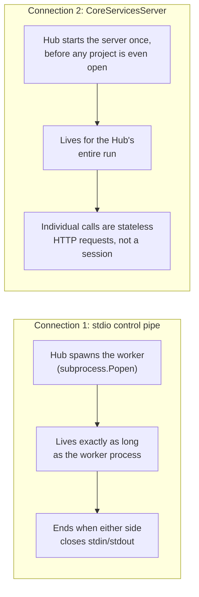
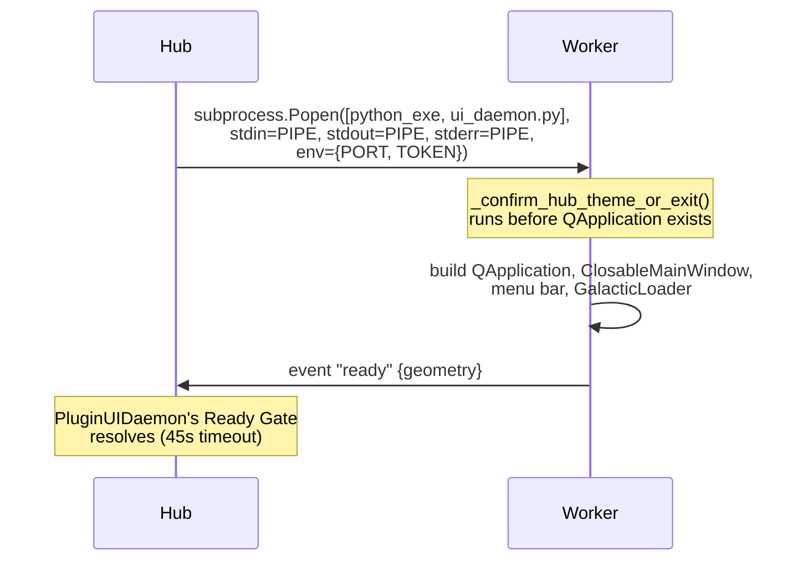
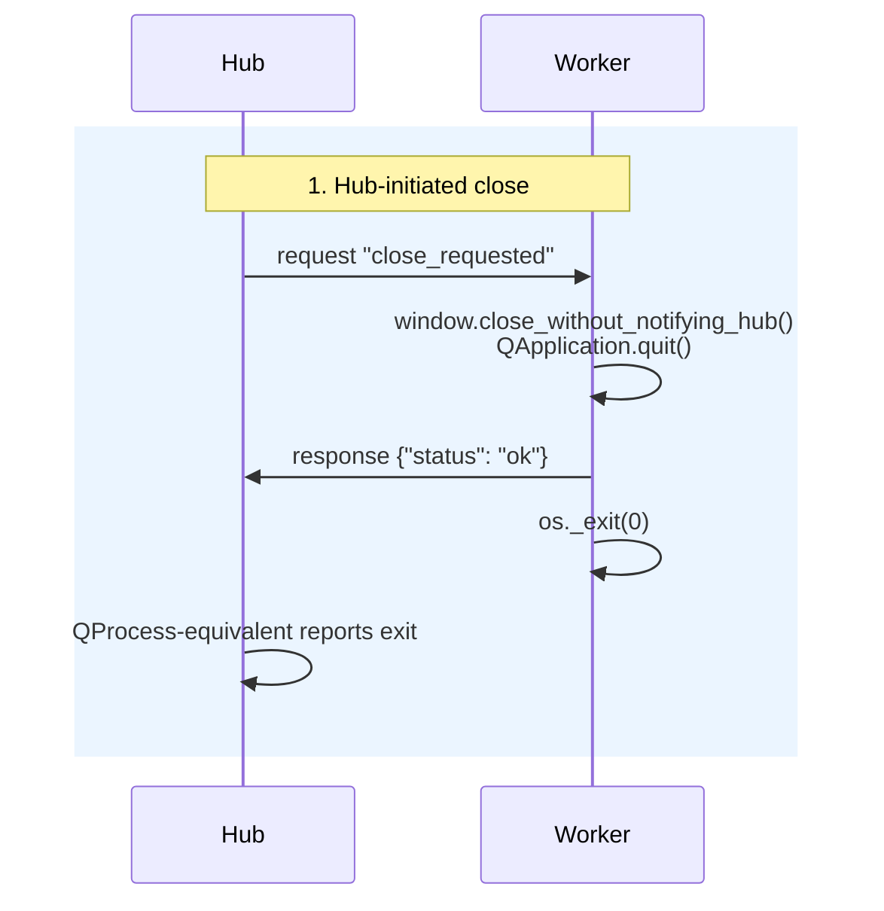
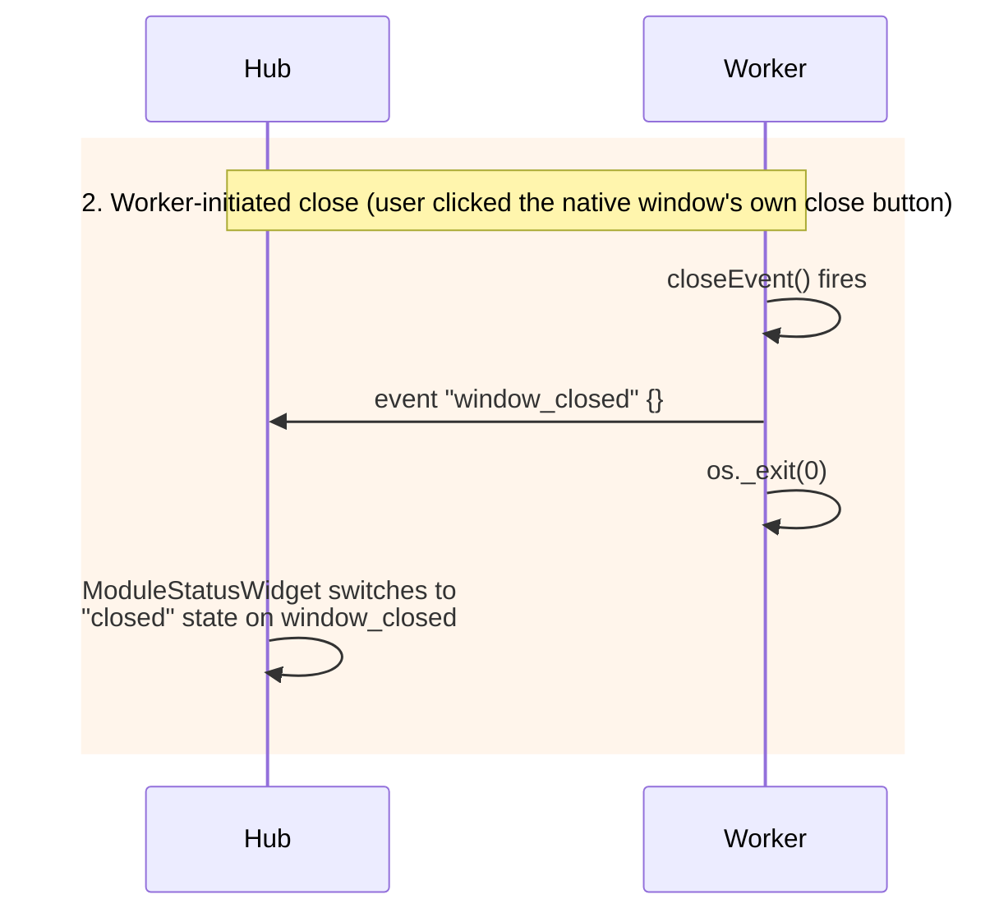
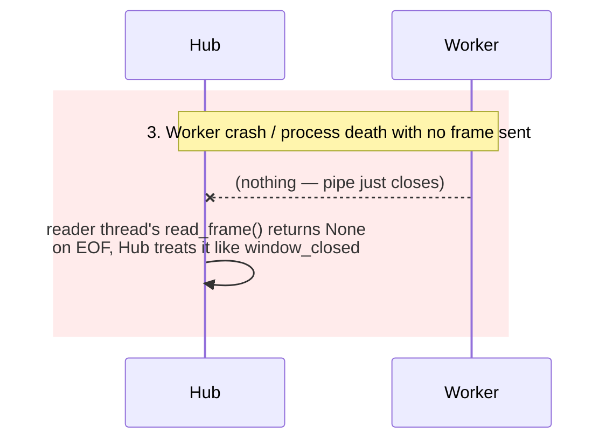
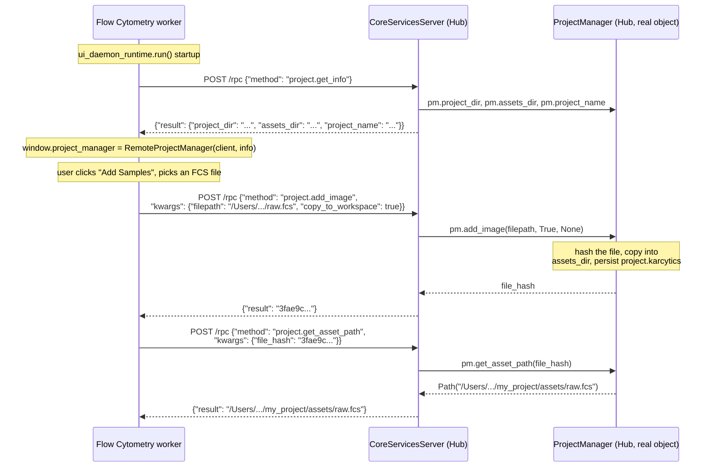
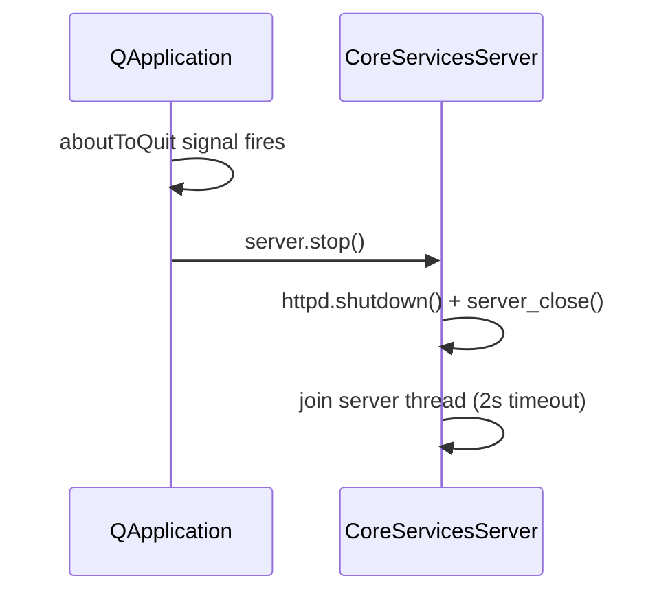
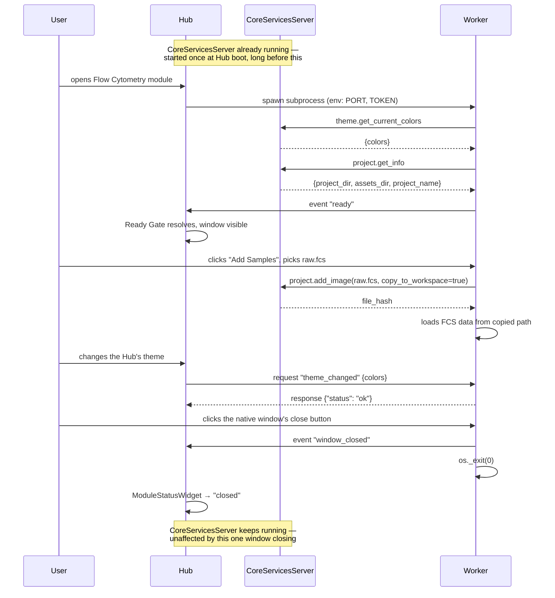

# Server/Client Lifecycle

`docs/internal/24_Plugin_Communication_Protocol.md` describes what each
channel between the Hub and an isolated plugin looks like — frame shapes,
threading, the RPC surface. This document walks the same two channels the
other way: as timelines. For each one — when does it open, what travels
across it while it's open, and how does it close, cleanly or otherwise.
Every step below is illustrated with the real request/response traffic a
Flow Cytometry session actually produces, not a hypothetical.

There are two connections, not one, and they have different lifetimes:



Connection 1 is per-plugin-window: it exists only while that one native
window's process is alive. Connection 2 is Hub-wide: it starts once at
`karcytics/__main__.py` startup and outlives every project you open and
close and every plugin window you spawn and dismiss during that run — a
worker process talks to it, but never "connects" to it in a stateful sense;
every call is its own authenticated HTTP request.

---

## Part 1 — The stdio control connection

This is the connection `PluginUIDaemon` (Hub side, `karcytics_sdk/plugin/daemon.py`)
and `ui_daemon_runtime.run()` (worker side, `karcytics_sdk/plugin/ui_daemon_runtime.py`)
speak over. One of these exists per running isolated plugin window.

### Opening



The connection *opens* the instant `subprocess.Popen` returns a live PID —
frames can be written to `proc.stdin` immediately. But nothing meaningful
can be *said* yet: the worker's `_RequestReader` thread and Qt event loop
don't exist until the theme gate passes and `QApplication` is constructed.
Practically, "the connection is open and useful" is the `ready` event,
which is why `PluginUIDaemon.ensure_started()` blocks on it rather than on
process spawn.

**Concretely, on the Hub side** (`karcytics/core/module_manager.py`, simplified):

```python
daemon = PluginUIDaemon.get_instance("flow_cytometry", daemon_script_path=script)
daemon.ensure_started(timeout=45.0)  # blocks until "ready" or raises
```

**On the worker side**, the very first bytes that cross the pipe are the
worker's own `ready` event, not anything the Hub sends first — the Hub's
role during opening is entirely environment (`env=...`) and patience.

### Communicating

Once open, three kinds of frame can cross this pipe, and — this is the
detail worth internalizing — **which side may say which kind is
asymmetric**:

| Hub → Worker | Worker → Hub |
|---|---|
| `request` (needs a reply) | `request` — never used in practice; nothing on the Hub side dispatches an *incoming* request |
| — | `response` (reply to a Hub request) |
| `event` — **not a thing; see below** | `event` (fire-and-forget) |

A concrete request/response, triggered by a real user action (switching the
Hub's theme while Flow Cytometry is open):

```python
# Hub side (ThemeManager.on_theme_changed, simplified)
daemon.call("theme_changed", {"colors": current_theme_colors()})
```

```
Hub → Worker:  {"kind": "request", "request_id": 7, "method": "theme_changed",
                "kwargs": {"colors": {"BG_DARKEST": "#0a0a0a", ...}}}
Worker → Hub:  {"kind": "response", "request_id": 7, "payload": {"status": "ok"}}
```

And a real fire-and-forget event, triggered by the user closing the native
window directly with the OS close button (not via the Hub):

```
Worker → Hub:  {"kind": "event", "topic": "window_closed", "payload": {}}
```

**The trap, and its resolution**: `PluginUIDaemon.send_event()` used to
exist and produce a syntactically valid `event` frame — but nothing on the
worker side ever read it as one. The worker's `RequestDispatcher.dispatch()`
only understands `{"method": ..., "kwargs": ...}`-shaped frames; an event
frame silently became `{"error": "Unknown method 'None'"}`, written back as
a `response` tagged with a `request_id` nothing was waiting for, so it
vanished with no crash and no visible symptom beyond "the thing I pushed to
the worker didn't happen." This was a real, shipped bug (see doc 24's
"Known failure modes" §3) — `ModuleStatusWidget.push_theme()` used
`send_event()` instead of `call()` and the Hub's theme changes silently
never reached the plugin.

That trap is now closed on both ends, not just documented:

- `PluginUIDaemon.send_event()` **no longer exists.** There was never a
  legitimate Hub → worker use for it — the worker's dispatcher has nothing
  that answers an unsolicited event, and adding one would mean building a
  second, unacknowledged delivery path for something `call()` already does
  reliably. Reaching for it now is an immediate `AttributeError` at the
  call site, not a frame that silently disappears at runtime.
- `ui_daemon_runtime.py`'s `handle_request` checks `frame.get("kind") ==
  "event"` before touching the dispatcher at all, and logs a loud, explicit
  warning (`unexpected_event_frame`) if one ever arrives — covering the
  case of a stray or version-mismatched frame reaching a worker some other
  way (a future Hub build talking to an older worker binary, say), not just
  the one call site that used to cause this.

**Rule: Hub → Worker is always `call()`.** There is no longer a
`send_event()` on that side to reach for by mistake.

### Ending

Three distinct ways this connection ends, and the Hub tells them apart by
which side spoke last:







Path 1 is what "Close Window" in the plugin's own File menu, or the Hub
closing the whole project, drives. Path 2 is the everyday case — someone
clicks the red/yellow/green traffic light (or Alt+F4). Path 3 is what a
segfault, an uncaught fatal Qt error, or `kill -9` produces; the Hub's
reader thread distinguishes "the process is gone" from "the process told me
it's closing" only by whether a frame arrived first.

Worth restating from doc 24 because it directly governs *how* this
connection ends: the worker exits via `os._exit()`, not `sys.exit()`. The
reader thread is a plain daemon thread blocked in a synchronous
`sys.stdin.buffer.read()` call with no cancellation point; normal
interpreter shutdown tries to flush and close that same buffered stream and
deadlocks acquiring a lock the reader thread holds. `os._exit()` skips
Python's finalization sequence entirely and ends the process at the OS
level — which is also why the leaked-semaphore investigation in this
codebase's history exists: `os._exit()` also skips every `atexit`
finalizer, including `multiprocessing`'s own semaphore cleanup, for
anything created but not yet torn down at that point.

---

## Part 2 — The `CoreServicesServer` connection

This is genuinely client/server, unlike Part 1 — a `ThreadingHTTPServer` on
loopback, bearer-token authenticated, one thread per request. It is *not*
scoped to a plugin window; it's scoped to the Hub process.

### Opening

```python
# karcytics/__main__.py, early in Hub startup — before any project exists
core_services_server = start_core_services()
```

```python
# karcytics/core/core_services_bootstrap.py
def start_core_services() -> CoreServicesServer:
    server = CoreServicesServer()
    server.register("diagnostics.report_error", _handle_report_error)
    server.register("theme.get_current_colors", _handle_get_current_colors)
    server.register("theme.list_categorized_themes", _handle_list_themes)
    server.register("theme.switch_theme", _handle_switch_theme)
    server.register("project.get_info", _handle_project_get_info)
    server.register("project.add_image", _handle_project_add_image)
    # ... the rest of the project.* surface
    server.start()
    PluginUIDaemon.set_core_services(server.port, server.token)
    return server
```

`server.start()` binds `127.0.0.1:0` (OS-assigned free port) and starts
serving on a background thread — this happens once, at Hub boot, with no
project open and no plugin window spawned yet. `PluginUIDaemon.set_core_services()`
records the port and a per-instance bearer token as class variables so
every plugin process spawned *afterward*, for the rest of this Hub run,
inherits them via `env`.

A worker doesn't "connect" at startup the way it does for Part 1 — it just
holds the port/token from its environment and makes its first call
whenever it first needs to (in practice, that's `_confirm_hub_theme_or_exit()`,
milliseconds after the process starts, calling `theme.get_current_colors`).

### Communicating

Every call is a complete, independent `POST /rpc` — there's no session,
no handshake beyond the bearer token on each request, no state carried
between calls other than what's genuinely global on the Hub side (the
current theme, the currently open project).

**Real-life example: importing an FCS file into a project.** This is the
concrete flow that motivated adding the `project.*` surface below — before
it existed, an isolated Flow Cytometry window had no way to learn what
project the Hub had open at all, so imported files never landed in that
project's `assets/` folder the way they did before process isolation.



The point worth noticing: `RemoteProjectManager` (`karcytics_sdk/host/core_services.py`)
exists purely so the plugin's own code doesn't have to know any of this
happened over HTTP. `fcs_loader_analysis.py`'s `_register_assets()` calls
`pm.add_image(path, should_copy)` exactly the way it always did when `pm`
was a live, in-process `ProjectManager` — `RemoteProjectManager.add_image()`
turns that into the RPC call above and hands back the same `str` a local
call would have. Nothing in the plugin needed to change; only what got
assigned to `window.project_manager` did.

On the Hub side, each `project.*` handler reaches "the currently open
project" through `core_services_bootstrap._get_active_project_manager()` —
a plain module-level reference, set by `WorkspaceWindow`'s launch path and
cleared on `return_to_hub()`, **not** a property of `ProjectManager` itself
(it has no idea an isolated plugin exists). Handlers that mutate project
state (`add_image`, `save_workflow`, `attach_workflow_file`) take a
module-level `threading.Lock` first — `ThreadingHTTPServer` answers each
request on its own thread, so two nearly-simultaneous imports (or an
import racing the Hub's own UI-thread project I/O) could otherwise
interleave a read-modify-write of the same in-memory `pm.data` dict and
corrupt `project.karcytics` on save.

Compare with `theme.switch_theme`, which needs a *different* kind of
guard: it calls `QApplication.setStyleSheet()`, so it must run on the Qt
GUI thread specifically, not just under a lock — see `QtThreadBridge` in
doc 24.

### Ending



There is no per-worker teardown here at all — a plugin window closing
(Part 1, above) has no effect on this connection; other plugin windows and
the Hub's own UI keep using the same server. It only stops once, when the
whole Hub process is quitting, via `QApplication.aboutToQuit`. A worker
process that's still alive when this happens simply gets connection
refused on its next call — in practice this never matters, because the Hub
shutting down already means every plugin window is being torn down via
Part 1's Hub-initiated close first.

---

## Both connections, one worked example, start to finish

Putting it together: opening Flow Cytometry on an existing project,
importing a file, then closing the window.



Three separate lifetimes are visible in this one scenario: the Hub process
itself (longest), `CoreServicesServer` (as long as the Hub runs), and this
one plugin window's stdio connection (shortest — opens on module launch,
closes on window close, and could repeat many times within a single
`CoreServicesServer` lifetime as the user opens and closes the module
repeatedly).

## Links

- `docs/internal/24_Plugin_Communication_Protocol.md` — wire format, frame
  kinds, the full registered RPC surface, and known failure modes in more
  depth than this document repeats.
- `docs/internal/25_Core_and_SDK_Boundary.md` — which package owns which
  half of what's described here.
- `karcytics_sdk/plugin/daemon.py` — `PluginUIDaemon`, the Hub-side half of
  Part 1.
- `karcytics_sdk/plugin/ui_daemon_runtime.py` — `run()`, the worker-side
  half of Part 1, including `_fetch_project_manager`.
- `karcytics_sdk/host/core_services.py` — `CoreServicesServer`/
  `CoreServicesClient`/`RemoteProjectManager`, Part 2 in full.
- `karcytics/core/core_services_bootstrap.py` — every handler the Hub
  registers on `CoreServicesServer`, including `set_active_project_manager`.
