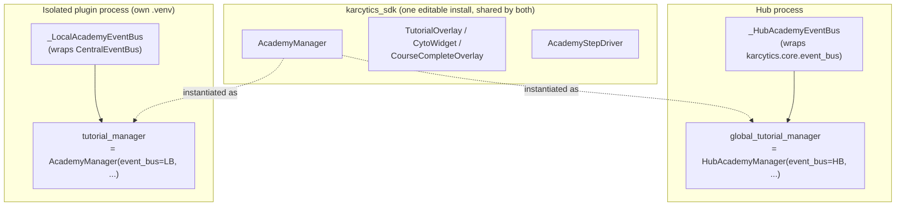
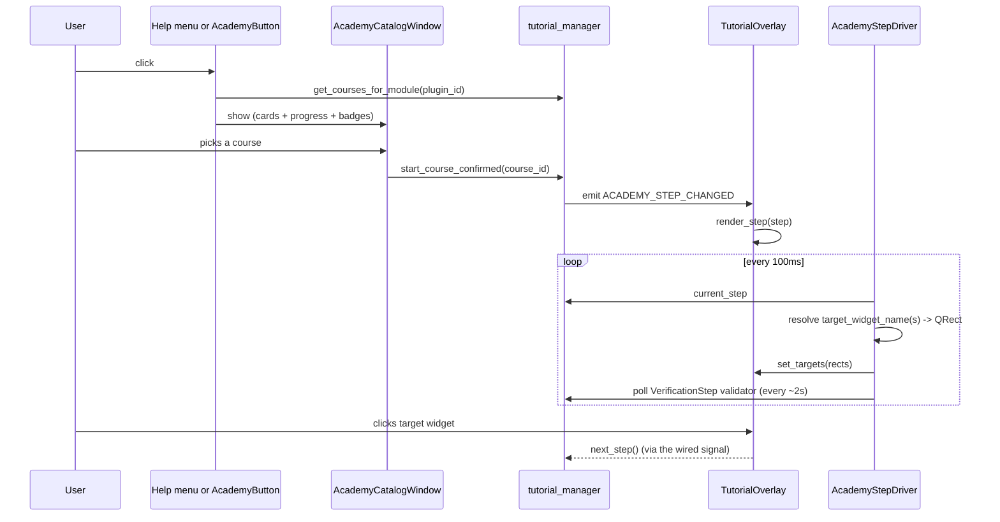

# The Academy Engine

Karcytics Academy — the in-app guided courses ("Cyto Academy") — used to be
Hub-only: `AcademyManager` lived in `karcytics/core/tutorial_manager.py`,
reached for the Hub's own `event_bus`/`AppConfig` directly, and its coaching
UI (`TutorialOverlay`, the animated `CytoWidget` mascot, the completion
screen) lived under `karcytics/ui/`. That was fine while every plugin ran
inside the Hub's own process and shared its widgets. Process isolation broke
it: an isolated plugin's own `.venv` can never import `karcytics.*`, so
nothing in that world could reach the engine or render a course at all.

This doc covers the fix — moving the whole engine into the SDK as one
canonical implementation both the Hub and every isolated plugin actually
run, not two copies kept in sync by hand — and how a plugin author writes a
course against it today.

## Why one shared class, not two kept in sync

Earlier splits in this codebase (`GalacticLoader`, `theme_fallback.py`) keep
a small, explicit per-process copy on each side specifically because the two
processes can never share the same *module* — different `.venv`s. Academy is
different: the **Hub is not in a separate `.venv` from the SDK**. It installs
`karcytics-sdk` as a plain editable dependency into its own environment
(`karcytics-sdk = { path = "../Karcytics-SDK", editable = true }`), so
`karcytics_sdk.plugin.academy.AcademyManager` is literally the same class
object whether the Hub or an isolated plugin's own `.venv` imports it. Only
an isolated plugin's `.venv` is genuinely a separate environment — and *that*
one has no access to `karcytics.*` at all, only to `karcytics_sdk`.

So the engine follows the same shape `AppConfig`/`AtomicJsonFile` used to
force on the old Hub-only class, just inverted into constructor arguments:

```python
class AcademyEventBus(Protocol):
    def subscribe(self, topic: str, callback: Callable[..., Any]) -> None: ...
    def unsubscribe(self, topic: str, callback: Callable[..., Any]) -> None: ...
    def emit(self, topic: str, *args: Any) -> None: ...

class AcademyManager:
    def __init__(self, event_bus: AcademyEventBus, persistence_dir: Path) -> None: ...
```

Every topic `AcademyManager` emits or subscribes to is a **plain string**,
not the Hub's `KarcyticsEvent` enum — every `ACADEMY_*` constant in
`karcytics_sdk/plugin/academy.py` is named to match that enum's member name
exactly, so a Hub-side adapter can always resolve `KarcyticsEvent[topic]`.

## Two instances, two adapters, one class



**Hub side** (`karcytics/core/tutorial_manager.py`, now a thin file):

```python
class _HubAcademyEventBus(AcademyEventBus):
    """topic (str) -> KarcyticsEvent[topic] -> the Hub's real event_bus."""
    def subscribe(self, topic, callback):
        event_bus.subscribe(KarcyticsEvent[topic], callback)
    def emit(self, topic, *args):
        event_bus.emit(KarcyticsEvent[topic], *args)
    # unsubscribe mirrors subscribe

class HubAcademyManager(AcademyManager):
    """Adds start_core_intro() — Hub-only content, no business in the SDK."""

hub_academy_event_bus = _HubAcademyEventBus()
global_tutorial_manager = HubAcademyManager(
    event_bus=hub_academy_event_bus, persistence_dir=AppConfig.APP_DATA_DIR / "academy"
)
```

**Plugin side** (`karcytics_sdk/plugin/runtime_services.py`):

```python
class _LocalAcademyEventBus:
    """Adapts CentralEventBus's single-payload publish/subscribe to
    AcademyManager's multi-arg emit(topic, *args) — always crossing as an
    explicit tuple, never collapsed to a bare value or None (a single None
    argument, e.g. current_step after a course completes, must stay
    distinguishable from "zero arguments")."""

academy_event_bus = _LocalAcademyEventBus()
tutorial_manager = AcademyManager(
    event_bus=academy_event_bus, persistence_dir=_academy_persistence_dir()
)
```

`_academy_persistence_dir()` reads `KARCYTICS_PLUGIN_ID` (set by
`PluginDaemon`/`PluginUIDaemon` on every worker spawn — see
`daemon.py`'s `_start_process()`) to scope progress under
`~/.karcytics/plugin_configs/<plugin_id>/academy/`, so two plugins' course
IDs can never collide in a shared progress file.

A plugin author's own code needs **zero changes** for this — `flow_cytometry`
already did `from karcytics_sdk.plugin.runtime_services import
tutorial_manager as global_tutorial_manager` and called
`register_storyboard()`/`start_course_confirmed()`/`next_step()` against it
before this migration too; only what that name resolved to changed, from
`NullTutorialManager` (an honest no-op stub) to a real, working state
machine.

## Writing a course

Course content is plain dataclasses from `karcytics_sdk.plugin.tutorial_models`
— `Course`, `InfoStep`, `InteractionStep`, `VerificationStep`, `ActionStep`,
`BranchingStep`, `ForcedInteractionStep`/`SubTask`, `SubplotCheckStep`,
`WaitForEventStep` — the same vendored copy the Hub's own `core_intro_course`
now imports too (`karcytics/tutorials/core_intro.py`), so there is exactly
one definition of these types in the whole system, not a Hub copy and an SDK
copy that could drift.

`flow_cytometry`'s three real courses
(`src/karcytics_plugins/flow_cytometry/tutorials/course{1,2,3}.py`, ~2,700
lines total) are the worked example. A representative step:

```python
InteractionStep(
    id="c1_s3_import",
    text="Click **Import Files** to load your first sample.",
    target_widget_name="btn_import_files",
    event_trigger="clicked",
    next_step_id="c1_s4_review",
)
```

Registration happens once, at plugin init:

```python
# karcytics_plugins/flow_cytometry/__init__.py
def register_courses(manager) -> None:
    for course in (course1, course2, course3):
        manager.register_storyboard(__plugin_id__, course)
```

**No course shipped in this codebase uses `WaitForEventStep`.** Every gate
flow_cytometry's courses use — `InteractionStep`/`event_trigger` (a local Qt
signal on a named target widget), `VerificationStep` (a local validator
polled against the plugin's own `state`), `ForcedInteractionStep`/`SubTask`
checklists, `ActionStep` — only ever touches the plugin's own live UI, in its
own process. `WaitForEventStep` (auto-advance when a *Hub-only* event fires,
e.g. `core_intro_course`'s `PROJECT_LOADED`/`STORE_OPENED`) is still the one
step type that needs a cross-process push channel for an isolated plugin.

That channel exists now (`docs/internal/28_Event_Bridging.md`'s
`RemoteEventBus`/`event.subscribe`/`dispatch_event`) — but it is **not**
the same bus `AcademyManager._subscribe_wait_event` calls. An isolated
plugin's `tutorial_manager` is still constructed with `academy_event_bus`
(`_LocalAcademyEventBus`, wrapping this process's own `CentralEventBus`) —
purely local pub/sub, unrelated to `RemoteEventBus`. So a `WaitForEventStep`
in a plugin course still can't gate on a genuine Hub-only event without a
course author (or a future change here) explicitly bridging the two: e.g.
`runtime_services.event_bus.subscribe(KarcyticsEvent.SOME_TOPIC, lambda p:
CentralEventBus.publish("SOME_TOPIC", p))` once, so `WaitForEventStep`'s own
local subscription then sees it. Nothing does this automatically today —
worth deciding whether `AcademyManager` should grow direct support for a
Hub-sourced `WaitForEventStep` now that the underlying transport exists, or
whether this manual-bridge pattern is good enough.

## Rendering: TutorialOverlay, CytoWidget, CourseCompleteOverlay

These are the coaching UI — the dimmed spotlight overlay, the animated Cyto
mascot (`cyto_character.py`, `cyto_costumes.py` — a `CostumeFactory` picking
a themed accessory by theme name, entirely vector-drawn, no bundled image
assets), and the badge/completion screen (`course_complete_overlay.py`). All
three now live in the SDK too (`karcytics_sdk/plugin/`), byte-for-byte the
same widgets on both sides — not a simplified plugin-side stand-in.

Two more dependencies needed the same "resolve differently per process,
transparently" treatment `theme_fallback.py` already established for
`Colors`:

- **Styling** — `theme_fallback.theme_manager.apply_style(widget, template)`
  now mirrors the Hub's real `ThemeManager.apply_style()` (tracks a
  `WeakKeyDictionary` of styled widgets, re-applies on `theme_changed`) and
  resolves `{TOKEN}` placeholders against whichever `Colors` class is
  actually live: the Hub's real one when `karcytics.ui.theme` is already in
  `sys.modules` (true inside the Hub's own process), `DynamicColors`
  otherwise. Every color token the ported widgets reference
  (`ACCENT_SUCCESS`, `BG_DARKER`, `ACCENT_WARNING`, `ACCENT_DANGER`, ...) had
  to actually exist in `DynamicColors`'s smaller fallback palette — a
  template referencing a missing key silently fails to compile as valid QSS
  (Qt logs "Could not parse stylesheet", doesn't crash) rather than raising,
  so this class of gap is easy to miss without live-rendering the widget and
  reading the log.
- **`ask_question`** → `karcytics_sdk.plugin.dialogs.ask_yes_no`, a plain
  `QMessageBox.question()` wrapper with no Hub dependency at all.

`TutorialOverlay` itself takes the same DI shape as `AcademyManager` —
`TutorialOverlay(academy_manager, event_bus, parent, compact_mode=False)` —
so a construction site on either side is a few explicit lines, not a
duplicate widget:

```python
# Hub (workspace_window.py)
self.tutorial_overlay = TutorialOverlay(
    global_tutorial_manager, hub_academy_event_bus, self.analysis_page
)

# Isolated plugin (ui_daemon_runtime.py, on first Help > Academy click)
overlay = TutorialOverlay(tutorial_manager, academy_event_bus, panel)
```

## Driving steps: AcademyStepDriver

`TutorialOverlay` only renders whatever step it's told to render — something
else has to notice the step changed, resolve `target_widget_name(s)` to real
`QWidget`s via `findChild`/`findChildren`, wire `InteractionStep`'s
auto-advance signal, and poll `VerificationStep`/`ForcedInteractionStep`
validators on a timer. In the Hub that driver is
`WorkspaceWindow.timerEvent()` — deeply tied to Hub-only concepts
(`PluginStoreDialog`, `home_screen`, `FlowCanvas` guide polygons). An
isolated plugin's window has none of that, just one panel, so
`karcytics_sdk.plugin.academy_driver.AcademyStepDriver` is a separate,
smaller class doing the same per-step-type work against a single
`search_root` instead of switching between pages — not an attempt to share
the Hub's own window-level orchestration.



## The isolated plugin's own entry point(s)

The old "🎓 Cyto Academy" button lived in `AnalysisToolBar`, inside a Hub
analysis page an isolated module never has. It's removed. Isolated plugins
get two entry points instead, both funneling into one shared function,
`karcytics_sdk.plugin.academy_driver.open_academy(window, panel)` — not
duplicated per entry point:

- **Help menu** — a **🎓 Academy** action, wired once `panel` exists
  (`_wire_academy_menu()` in `ui_daemon_runtime.py`, since `_build_menu_bar()`
  itself runs before `panel_factory()` — see that function's own docstring
  for why), in the same isolated Help menu
  `docs/internal/24_Plugin_Communication_Protocol.md`'s "isolated window's
  menu bar" section covers.
- **In-panel toolbar** — `components.AcademyButton`, a plugin drops it into
  its own layout wherever makes sense (flow_cytometry's `workspace_builder.py`
  places it on the workspace's top bar) and wires its `clicked` signal to
  `open_academy(window, panel)` itself — nothing in the SDK does this
  automatically, since only the plugin knows where its own toolbar chrome
  lives.

Either way, `open_academy()` doesn't silently jump into a course: it opens
`AcademyCatalogWindow` (`karcytics_sdk/plugin/academy_window.py`) — a modal
course picker (cards, per-course progress pills, earned badges, an animated
particle-network background) mirroring what the pre-isolation Hub's own
Academy dashboard showed. Clicking a course there is what actually calls
`start_course_confirmed()` and raises the `TutorialOverlay`, building the
`TutorialOverlay`/`AcademyStepDriver` pair lazily on first use and caching
both on `window` so a second open reuses them. Zero registered courses shows
a plain "no courses yet" message instead of an empty or dead catalog window.

The Hub's own Academy entry point (home dashboard's global "🎓 Academy"
button, plus each module card's own pill) is unaffected — it still opens
`AcademyWindow`, scoped now to only what the Hub can actually discover:
`core_intro` and any other Hub-owned course. The old
`importlib.import_module("karcytics.plugins.<pkg>")` course-discovery loop
inside `AcademyWindow._populate_courses()` — which always raised
`ModuleNotFoundError` for an isolated module, silently caught — is gone; an
isolated plugin's courses were never reachable that way and now nothing
pretends otherwise. The orphaned `AcademyDashboard`
(`karcytics/ui/dashboards/academy_dashboard.py`, wired to nothing) was
deleted outright.

## Verification

- SDK unit tests: `tests/unit/plugin/test_academy.py` (the state machine
  against a fake `AcademyEventBus`), `test_runtime_services.py`
  (`_LocalAcademyEventBus`'s multi-arg roundtrip), `test_ui_daemon_runtime_menu.py`
  (`TestWireAcademyMenu` — clicking with zero vs. one registered course).
- Live: real `ui_daemon.py` spawned exactly as the Hub spawns it (real
  `CoreServicesServer`, real subprocess, `flow_cytometry`'s own `.venv`) logs
  `Registered Academy course '...'` for all three real courses into the real
  `AcademyManager` — not the old null stub — and stays responsive. A second
  script builds the real `FlowCytometryPanel` via the same path
  `ui_daemon.py` uses, drives `start_course_confirmed()` on a real course,
  and confirms `TutorialOverlay` renders real step text and
  `AcademyStepDriver` resolves target widgets without crashing.

## Links

- `docs/internal/28_Event_Bridging.md` — the transport `WaitForEventStep`
  would need to reach a genuine Hub-only event; not yet wired directly into
  `AcademyManager`'s own event bus, see this doc's own "Writing a course"
  section above.
- `docs/internal/24_Plugin_Communication_Protocol.md` — the isolated
  window's menu bar, which the Help ▸ 🎓 Academy action is part of.
- `karcytics_sdk/plugin/academy.py`, `academy_driver.py`, `academy_window.py`,
  `tutorial_overlay.py`, `cyto_character.py`, `cyto_costumes.py`,
  `course_complete_overlay.py` — the full engine and its coaching UI, all in
  one place now.
