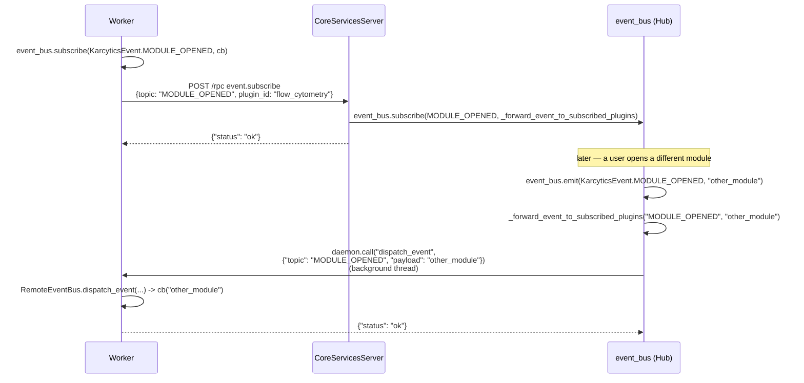

# Event Bridging: Hub → Isolated Plugin

`docs/internal/24_Plugin_Communication_Protocol.md` documented this as a real
gap, twice over: `RemoteEventBus.subscribe()`/`.unsubscribe()`
(`karcytics_sdk/plugin/runtime_services.py`) were permanent no-ops, and the
"Notably absent, by design" section listed the Hub's `EventBus` as simply not
exposed to an isolated plugin at all. `.emit()`/`.publish()` (plugin → Hub)
already worked — a worker already pushes unsolicited events over the stdio
pipe (`window_closed`, theme acks). The missing direction was Hub → plugin:
nothing let the Hub push an arbitrary named event into a running isolated
worker.

This closes that gap, scoped deliberately narrow: a worker can subscribe to
one of the Hub's own `KarcyticsEvent` topics, and only that worker, only for
that topic, ever receives a forwarded `emit()`. There is no broadcast mode.

## Why this, and not something bigger

Two constraints shaped the design:

- **Reuse the existing channels, don't add a third.** `CoreServicesServer`
  (worker → Hub, loopback HTTP) already exists for exactly this kind of
  "a worker needs to reach a shared Hub service" call — subscribing is one
  more RPC method on it, `event.subscribe`/`event.unsubscribe`. Actually
  *delivering* the forwarded event needs the other direction, which
  `docs/internal/26_Server_Client_Lifecycle.md` already established has
  exactly one rule: **Hub → Worker is always `call()`**. `dispatch_event` is
  a new request method on that same stdio pipe, not a new mechanism.
- **Never forward what nobody asked for.** A blind "mirror every Hub event
  into every running worker" would work today just as well as scoped
  delivery — with only one plugin (Flow Cytometry) and a handful of topics,
  the difference is invisible. It stops being invisible the moment a second
  isolated plugin exists: an unscoped bridge means every worker's process
  now pays to deserialize and dispatch every other plugin's events too, and
  a Hub-side event whose payload wasn't meant to leave the Hub (nothing
  today, but nothing stops it either) leaks to processes with no reason to
  see it. Scoping by explicit subscription costs one registry lookup and
  avoids designing that mistake in from the start.

## The two new call sites, end to end

```mermaid
flowchart LR
  subgraph "Worker process"
    RC["Plugin/SDK code"] -->|subscribe topic, cb| REB[RemoteEventBus]
    REB -->|first subscriber\nfor this topic| CSC["CoreServicesClient.call\n'event.subscribe'"]
    DE["_handle_dispatch_event\n(ui_daemon_runtime.py)"] -->|dispatch_event topic, payload| REB
    REB -->|cb(payload)| RC
  end
  subgraph "Hub process"
    CSC -->|POST /rpc| CSS[CoreServicesServer]
    CSS --> HES["_handle_event_subscribe\n(core_services_bootstrap.py)"]
    HES -->|first subscriber\nfor this topic| SUB["event_bus.subscribe(\n  KarcyticsEvent[topic],\n  _forward_event_to_subscribed_plugins)"]
    EB["karcytics.core.event_bus\n.emit(topic, ...)"] --> SUB
    SUB --> FWD[_forward_event_to_subscribed_plugins]
    FWD -->|daemon.call\n'dispatch_event'\non a background thread| PUD[PluginUIDaemon]
  end
  PUD -->|stdio: request| DE
```

### Worker side: `RemoteEventBus`

`RemoteEventBus.subscribe(event_type, callback)` (`runtime_services.py`) does
two things, and only the first one talks to the Hub at all:

1. Appends `callback` to a local `dict[topic, list[callback]]` — this is
   what actually gets invoked later, and it's checked *first*.
2. **Only if this is the first local subscriber for that topic**, calls
   `client.call("event.subscribe", topic=topic, plugin_id=...)`. A second
   local subscriber to the same topic (or a third, ...) is served from the
   one Hub-side registration the first subscriber already made — there is
   no per-callback RPC traffic.

```python
event_bus.subscribe(KarcyticsEvent.MODULE_OPENED, my_callback)
```

`unsubscribe()` mirrors it exactly in reverse: removes the callback locally,
and only calls `event.unsubscribe` once the local list for that topic is
empty. Both RPC calls degrade gracefully (log a warning, keep the local
subscription) if `KARCYTICS_CORE_SERVICES_PORT`/`TOKEN` aren't set at all —
same "never crash on an unreachable Hub" posture every other
`CoreServicesClient` call site in this codebase already has.

`dispatch_event(topic, payload)` is the receiving half — called by
`ui_daemon_runtime.py`'s `_handle_dispatch_event` request handler, never by
the worker itself — and just invokes every locally-registered callback for
that topic, one at a time, each wrapped in its own `try`/`except` so one
raising subscriber can't stop the rest or crash the request dispatcher it
runs under.

### Hub side: registry + one listener per topic

`core_services_bootstrap.py` keeps one small piece of state:
`_event_subscriptions: dict[str, set[str]]` — topic name to the set of
`plugin_id`s that want it — guarded by a lock, alongside
`_hub_topics_bridged: set[str]` tracking which topics already have a
forwarding listener wired onto the Hub's own `event_bus`.

`_handle_event_subscribe` resolves `topic` (a plain string, same convention
`AcademyManager`'s own `AcademyEventBus` protocol uses — see
`docs/internal/27_Academy_Engine.md`) to a real `KarcyticsEvent` member via
`KarcyticsEvent[topic]`, rejecting an unknown name outright. It adds
`plugin_id` to that topic's subscriber set — and **only the first time any
plugin ever asks for that topic**, calls
`event_bus.subscribe(event_type, partial(_forward_event_to_subscribed_plugins, topic))`.
Every later subscriber, to that topic or a different one, just extends the
existing set; the Hub-side listener for a topic is never registered twice.

`_forward_event_to_subscribed_plugins(topic, *args, **kwargs)` — the
function that listener actually calls — reads the current subscriber set,
and for each `plugin_id` still in it, looks up its `PluginUIDaemon` via the
new `PluginUIDaemon.get_running_instance(plugin_id)` (returns `None` if that
plugin isn't currently running — never registers a phantom entry the way
`get_instance()` would) and calls `daemon.call("dispatch_event", {"topic":
topic, "payload": payload})` **on its own background thread, one per
plugin**. This matters for the same reason `plugin_loader.py`'s
`_send_workflow` already runs off the GUI thread: `daemon.call()` blocks on
that worker's own response, and the Hub's `event_bus.emit()` call that
triggered all of this runs synchronously on the Hub's GUI thread — a slow or
wedged worker must never stall every other listener of that same Hub event,
isolated or not.

`_handle_event_unsubscribe` removes `plugin_id` from the topic's subscriber
set. It does **not** remove the Hub-side listener even once a topic's last
subscriber leaves — `_forward_event_to_subscribed_plugins` is cheap and
correctly inert against an empty subscriber set (an early return before
touching any daemon), and un-registering it would need the exact `partial`
object handed to `event_bus.subscribe()` back for `.unsubscribe()`, tracked
somewhere, for a saving that's one dict lookup on a fixed, small set of
`KarcyticsEvent` members. Not worth the bookkeeping.

### Worker side, receiving: `dispatch_event`

```python
def _handle_dispatch_event(kwargs: dict[str, Any]) -> dict[str, Any]:
    from .runtime_services import event_bus
    topic = kwargs.get("topic", "")
    event_bus.dispatch_event(topic, kwargs.get("payload"))
    return {"status": "ok"}

dispatcher.register("dispatch_event", _handle_dispatch_event)
```

Registered alongside `exit`/`theme_changed`/`focus`/`inject_workflow` in
`ui_daemon_runtime.py`'s `run()` — see `docs/internal/24`'s "Built-in request
handlers" table. The Hub only ever calls this for a topic the worker itself
subscribed to; there's no server-side path that reaches a worker's
`dispatch_event` any other way.

## A worked example, start to finish



And the scoping guarantee, the other half of what this had to prove:
`PROJECT_LOADED` firing on the Hub's real `event_bus` while nothing
subscribed to it never reaches this same worker at all — the subscriber-set
lookup in `_forward_event_to_subscribed_plugins` returns empty and nothing
is ever sent.

## Verification

- Hub-side unit tests (`tests/core/test_core_services_bootstrap.py`):
  `event.subscribe`/`event.unsubscribe` registry behavior, that a second
  subscriber doesn't re-wire the Hub-side listener, and
  `_forward_event_to_subscribed_plugins` called directly against a mocked
  `PluginUIDaemon.get_running_instance` (confirms the background-thread
  dispatch and the exact `dispatch_event` payload shape).
- Worker-side unit tests (`karcytics_sdk`'s `tests/unit/plugin/test_runtime_services.py`):
  `RemoteEventBus` subscribe/unsubscribe/dispatch behavior, including "only
  the first local subscriber calls the Hub" and "a raising subscriber
  doesn't stop the rest."
- **Live round trip**, the two checks this feature's own design called for:
  a real spawned worker process subscribes to `KarcyticsEvent.MODULE_OPENED`
  via the real `RemoteEventBus`; the Hub's real `event_bus.emit()` fires it;
  the worker's own registered callback actually runs, confirmed by an event
  it sends back to the Hub in response
  (`tests/core/test_core_services_bootstrap.py::test_event_bridging_round_trip_with_a_real_spawned_worker`).
  A second live test confirms a topic the worker never subscribed to
  (`PROJECT_LOADED`) never reaches it, even though the Hub genuinely emits it
  (`test_unsubscribed_topic_never_reaches_a_real_spawned_worker`).

## What this doesn't do (yet)

- **Not wired into `AcademyManager`.** An isolated plugin's `tutorial_manager`
  still runs on its own local `academy_event_bus`
  (`_LocalAcademyEventBus`/`CentralEventBus`), a separate bus from
  `RemoteEventBus`. A course's `WaitForEventStep` can't gate on a real
  Hub-only event without an explicit bridge between the two — see
  `docs/internal/27_Academy_Engine.md`'s "Writing a course" section.
- **No payload schema enforcement.** Whatever `event_bus.emit(topic, *args,
  **kwargs)` was called with crosses as-is (`kwargs` if present, else the
  single positional arg, else the full tuple) — same shape `RemoteEventBus
  .emit()` already used for the plugin → Hub direction. A plugin subscribing
  to a topic needs to know what that specific `KarcyticsEvent` actually
  carries (see `karcytics/core/event_bus.py`'s own per-member comments).

## Links

- `docs/internal/24_Plugin_Communication_Protocol.md` — the wire protocol
  and RPC surface this extends (`event.subscribe`/`unsubscribe`,
  `dispatch_event`).
- `docs/internal/26_Server_Client_Lifecycle.md` — the "Hub → Worker is
  always `call()`" rule this stays inside of.
- `docs/internal/25_Core_and_SDK_Boundary.md` — Migration status item #4,
  which used to list this as an open gap.
- `docs/internal/27_Academy_Engine.md` — why `WaitForEventStep` still can't
  use this directly today.
- `karcytics_sdk/plugin/runtime_services.py` — `RemoteEventBus`.
- `karcytics_sdk/plugin/ui_daemon_runtime.py` — `_handle_dispatch_event`.
- `karcytics_sdk/plugin/daemon.py` — `PluginUIDaemon.get_running_instance`.
- `karcytics/core/core_services_bootstrap.py` — `_handle_event_subscribe`,
  `_handle_event_unsubscribe`, `_forward_event_to_subscribed_plugins`.
