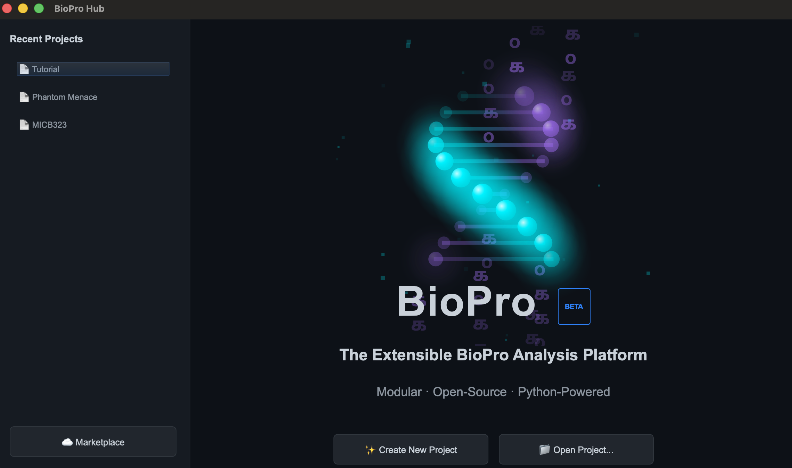

# Getting Started

This guide helps you launch Karcytics for the first time, create or open a project, and find the main controls in the Project Hub.

---

## Before You Begin

If Karcytics is not yet installed, start with the [Installation](06_Installation.md) page first.

Karcytics stores its application data in your home folder under `~/.biopro`. This includes installed plugins, trusted developer keys, logs, and recent project settings.

---

## Launching Karcytics

1. Open Karcytics from your operating system’s application launcher or the extracted installation folder.
2. On first launch, Karcytics displays the **Project Hub**.
3. The Hub is where you select a project, install plugins, and access help.

> [!NOTE]
> You can reopen the Hub from the workspace by choosing **File → Home Screen** or by clicking the home button in the top toolbar.

---

## The Project Hub

The Project Hub has two primary areas:

* **Recent Projects** — A list of your most recently opened projects.
* **Action Buttons** — Create a new project, open an existing project, or open the Marketplace.

### What you can do from the Hub

* **Create New Project** — Start a new saved workspace for your experiment.
* **Open Project** — Select an existing Karcytics project directory.
* **☁️ Marketplace** — Install and manage analysis modules.
* **🎓 Academy** — Launch Cyto’s guided learning experience for beginner onboarding and module tutorials.

> [!NOTE]
> The Hub also displays update notifications when a new Karcytics core version is available.

---

## Creating a New Project

1. Click **✨ Create New Project**.
2. Enter a project name.
3. Choose a folder on your computer where the project will live.
4. Confirm to create the project.

Karcytics saves every project as a directory containing:

* `project.karcytics` — the main project state file.
* `assets/` — managed assets such as images and attachments.
* `workflows/` — saved workflow snapshots produced by analysis modules.
* `.karcytics.lock` — a temporary lock file created while the project is open.

> [!WARNING]
> Do not open the same project in more than one instance of Karcytics at the same time.

---

## Opening an Existing Project

1. Click **📁 Open Project...**.
2. Navigate to the project folder that contains `project.karcytics`.
3. Select the folder and open it.

If another instance of Karcytics is already using the project, the app will warn you and prevent the second open to avoid data corruption.

If Karcytics crashed previously and left a stale lock file, you may safely remove `.karcytics.lock` from the project folder before reopening.

---

## Navigating the Help Center

Karcytics includes a built-in Help Center for offline documentation.

* Press **F1** to open the Help Center from any workspace.
* In the Help menu, choose **📖 Karcytics Help Center**.
* Use the **Restart Onboarding Tour** action under Help if you want to replay the guided introduction.

---

## Using Cyto Academy

Use the **🎓 Academy** button in the home ribbon or workspace toolbar to launch Cyto’s guided startup lessons.

* The startup course walks you through opening a project, installing a plugin, and running your first analysis.
* If a module is required for the course, Cyto will prompt you to install it from the Marketplace.
* Academy lessons are a great way to learn the app without affecting your main project data.

> [!NOTE]
> Screenshot placeholder: Cyto Academy launch button and guided startup workflow.

---

## What Comes Next

Once you have a project open, install the analysis tools you need from the Marketplace and then follow the [Tutorial](03_Tutorial_First_Analysis.md) for a first analysis.
