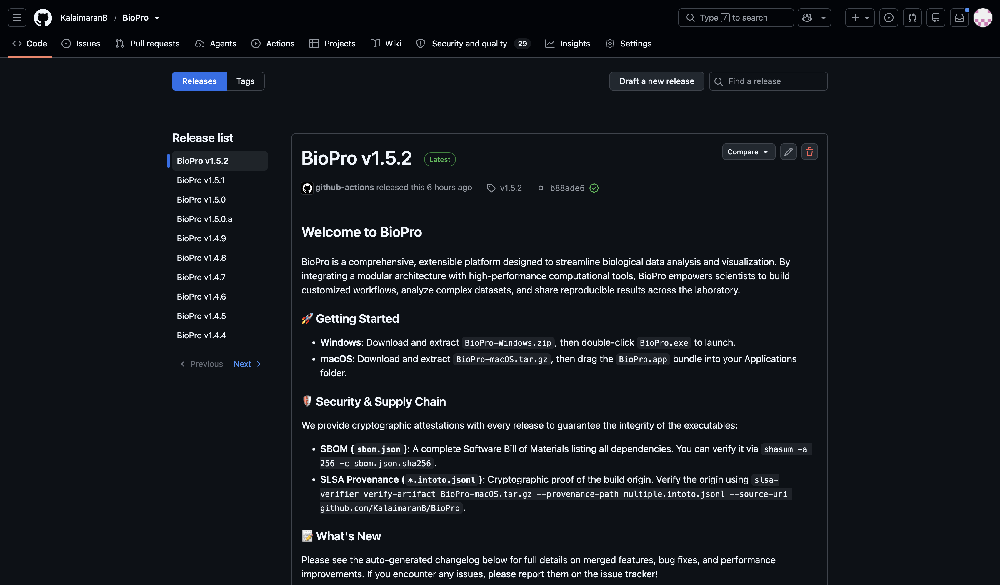

# Installation

Karcytics is distributed as a desktop application with a lightweight plugin ecosystem. The core application is installed once, and analysis modules are added later from the in-app Plugin Store.

---

## Downloading Karcytics

Use the official GitHub Releases page for the latest stable downloads:

* [Karcytics Releases](https://github.com/KalaimaranB/Karcytics/releases)

Look for the latest asset that matches your platform:

* `Karcytics-Windows.zip` for Windows
* `Karcytics-macOS.tar.gz` for macOS

> [!NOTE]
> If you are using Karcytics from source or a development build, follow the instructions in the repository README instead of the packaged installer workflow.

---

## Windows Installation

1. Download `Karcytics-Windows.zip` from the latest GitHub release.
2. Extract the ZIP archive to a folder you control (for example, `C:\Users\<you>\Documents\Karcytics`).
3. Open the extracted folder and double-click `Karcytics.exe` to launch the application.
4. If Windows SmartScreen warns that the app is unrecognized, choose **More info** and then **Run anyway** only if you trust the source.

> [!NOTE]
> Keep the extracted folder in a stable location. Moving or deleting files after first launch may break the app or installed plugins.

### First launch on Windows

* The first time you launch Karcytics, it will create application state in your home directory under `~/.biopro`.
* This folder stores installed plugins, logs, trusted developer keys, and recent project history.

---

## macOS Installation

1. Download `Karcytics-macOS.tar.gz` from the latest GitHub release.
2. Double-click the downloaded file to extract the `Karcytics.app` bundle.
3. Drag `Karcytics.app` into your **Applications** folder.
4. Open `Karcytics.app` from Applications.

### macOS security and Gatekeeper

macOS may display a warning the first time you open Karcytics because it is not notarized by Apple’s App Store.

* Right-click (or Control-click) `Karcytics.app` and choose **Open**.
* In the security warning, click **Open** again to allow the app to run.
* If that does not work, open **System Settings > Privacy & Security**, then click **Open Anyway** for Karcytics.

> [!WARNING]
> Only override Gatekeeper for Karcytics if you downloaded the app from the official repository and release page.

---

## Installing Analysis Modules

Karcytics itself is a host application. The actual analysis tools are delivered as plugins and installed from within the app.

1. Launch Karcytics.
2. From the Project Hub, click **☁️ Marketplace**.
3. Browse or search for the analysis module you want.
4. Click **Install** to download and enable the plugin.
5. Return to the Home Screen to launch the new module.

> [!TIP]
> The Plugin Store has filters for **All Modules**, **Available Updates**, **Installed**, and **Trusted Developers**.

### Core application updates

Karcytics checks for new core application versions automatically when the Hub starts. If a new version is available, an update banner appears at the top of the Hub.

* Click **Download Now** in the banner to open the latest release page.
* Click **Skip This Version** if you want to stay on your current release temporarily.

---

## Supported Platforms

Karcytics is designed for modern Windows and macOS systems. Linux builds may be available through source installation and developer distributions, but the primary supported packages are Windows and macOS.

---

## Troubleshooting installation

* If the app does not start, check that the downloaded archive extracted completely and that `Karcytics.exe` or `Karcytics.app` is present.
* If the app cannot write to its data folder, verify your user account has permission to access your home directory.
* If a plugin fails to install from the Marketplace, make sure you have an active internet connection and that the release page is reachable.

> [!NOTE]
> Application logs are stored in `~/.biopro/karcytics.log` and can be viewed from the Help menu once Karcytics is running.
