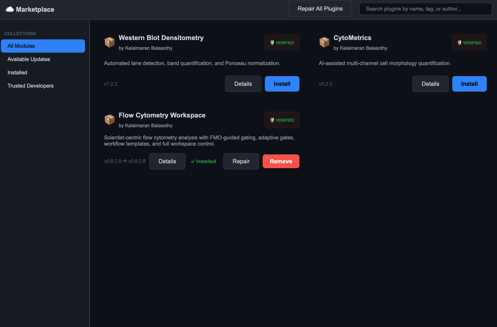

# Plugin Store and Security

BioPro uses a verified plugin architecture to separate the core application from analysis tools. Plugins are installed, updated, and managed from the in-app Marketplace, while security controls protect your system from modified or untrusted modules.

---

## What is the Plugin Store?

The Plugin Store is the central place to discover and manage analysis modules for BioPro.

* **Install** new modules without manually copying files.
* **Update** installed plugins when new versions are available.
* **Remove** plugins you no longer need.
* **Inspect** publisher details and trust status before running a module.

> [!NOTE]
> The Plugin Store is available from the Project Hub by clicking the **☁️ Marketplace** button.

---

## Marketplace Collections

The Plugin Store divides modules into a few helpful collections:

* **All Modules** — Browse every module that the registry knows about.
* **Available Updates** — See plugins that have newer versions available.
* **Installed** — Quickly review modules already installed on your machine.
* **Trusted Developers** — View developer identities that are currently trusted or available for trust.

---

## Installing and Updating Plugins

1. Open the Marketplace.
2. Use the search field to find a module by name, author, or category.
3. Click the module card to reveal details.
4. Click **Install** to download and unpack the plugin.
5. If an update is available later, return to the Marketplace and choose **Available Updates**.

### How plugin installation works

Installed plugins are stored in the application data folder at `~/.biopro/plugins`.

* The Marketplace downloads plugin packages from the remote registry.
* The package is extracted safely into its own plugin folder.
* BioPro updates a local `installed.json` registry to remember which modules are installed and what version is active.

> [!TIP]
> If a plugin package contains a single top-level folder, BioPro will flatten it so the plugin still loads correctly.

---

## Plugin Security Statuses

Every plugin is classified by a trust status when BioPro discovers it.

* **Verified Secure** — The plugin’s signature is valid and the developer identity is part of the trusted authority chain.
* **Untrusted** — The plugin files are intact, but the developer's signing key is not currently trusted. BioPro blocks execution until you approve the developer.
* **Outdated** — The plugin version is incompatible with the installed BioPro core and needs an update.

If a plugin is blocked because it is untrusted, BioPro will prompt you before it runs and show a high-visibility security dialog explaining the risk.

---

## Trust and Developer Identity

BioPro keeps a list of trusted developer keys and authorities in `~/.biopro/trusted_roots`.

When you install or inspect a plugin, the app may display one of the following trust paths:

* **Verified Root Trust Chain** — The developer key is verified by the official BioPro root authority and a signed registry.
* **Manually Approved Root (Local Override)** — You manually added the developer's public key to your local trust store.
* **Unverified Self-Signed Identity** — The developer key is present, but no trusted root or authority path is available.

### Approving an untrusted developer

> [!NOTE]
> Screenshot placeholder: plugin trust approval dialog with developer identity, public key, and trust options.

When BioPro asks you to trust a new developer, review the developer name and public key carefully. If you recognize the source:

1. Click **Trust this Developer** in the security dialog.
2. BioPro saves the developer key locally and allows their plugins to run on your machine.
3. The plugin can now load normally in future sessions.

If you do not recognize the developer or do not want to trust them, click **Not Now** and do not load the plugin.

---

## Plugin Details and Diagnostics

Each plugin card includes an option to inspect details such as:

* Publisher name and version
* Minimum required BioPro core version
* Verification status badge
* Developer identity and trust path

The Marketplace also provides a **Diagnose & Repair** action.

* Use **Repair** to rebuild the plugin state if the module is missing files, cannot be loaded, or fails a trust check.
* Use **Repair All Plugins** to run a broader cleanup across all installed plugins.

---

## Keeping plugins up to date

BioPro periodically synchronizes plugin metadata from a remote registry. The Marketplace uses this registry to determine which plugins are new or updated.

If a plugin no longer loads after updating, check the plugin details and trust path. You may need to reinstall the plugin or approve a newly published developer key.

---

## When things go wrong

* If a plugin fails to install, confirm your internet connection and retry.
* If a plugin is blocked as untrusted, verify the developer identity or remove the plugin if you do not trust it.
* If a plugin reports a missing dependency, the problem may be caused by the module's container environment. Use the plugin repair action or reinstall the plugin.

> [!NOTE]
> The Plugin Store is not a generic file browser. It only manages verified plugins that conform to BioPro’s dynamic plugin model.
