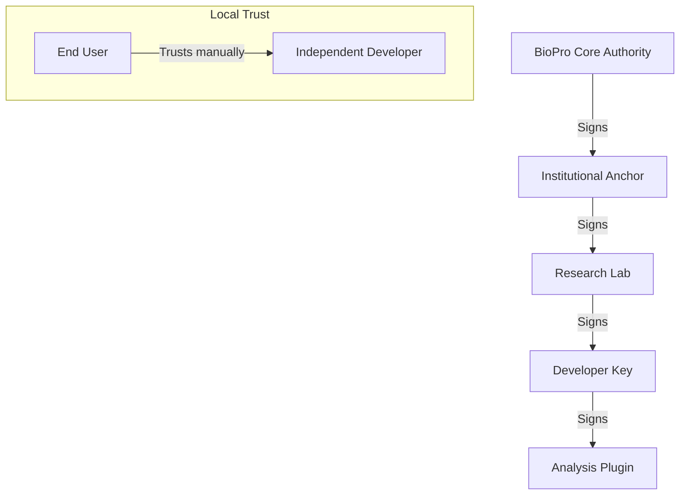

# Security and Trust Architecture

BioPro implements a public key infrastructure (PKI) based trust model to verify the integrity and origin of analysis plugins. This prevents the execution of unauthorized or tampered code.

---

## The Trust Hierarchy

BioPro utilizes cryptographic signatures to establish trust.

### 1. Root Anchors
The BioPro application includes hardcoded public keys representing the root authority. Official plugins must be cryptographically traceable to these root keys.

### 2. Delegated Authorities
Institutions or labs can be issued delegated signing authority. A developer's public key is signed by a higher authority, and this signature (delegation) is bundled with the plugin to prove its authenticity.

### 3. Local Trust
Users can manually configure trust for independent developers. By adding a developer's public key to the local trusted roots (`~/.biopro/trusted_roots/`), the local BioPro instance will recognize and execute their plugins.

---

## Plugin Verification Process

Upon loading a plugin, the `TrustManager` module executes three primary validation steps:

1.  **Hash Verification**: It calculates the SHA-256 hash of every file within the plugin directory and compares them against the hashes listed in the plugin's signed manifest. If there is a mismatch, the plugin is rejected.
2.  **Signature Verification**: It verifies the digital signature of the manifest using the developer's bundled public key.
3.  **Chain of Trust Verification**: It traverses the delegation chain to ensure the developer's key is signed by a recognized anchor (either a root authority or a locally trusted key).

---

## Developer Signing Process

Developers must sign their plugins prior to distribution:
1.  **Key Generation**: Use the SDK CLI to generate a key pair (`biopro-sign init`).
2.  **Delegation (Optional)**: Obtain a signature from an authority to create a delegation chain.
3.  **Plugin Signing**: Use the SDK CLI to sign the plugin directory (`biopro-sign sign <folder>`). This generates the manifest and signature files.

For detailed instructions, refer to the [Security and Signing Guide](../internal/20_Security_and_Signing.md).
